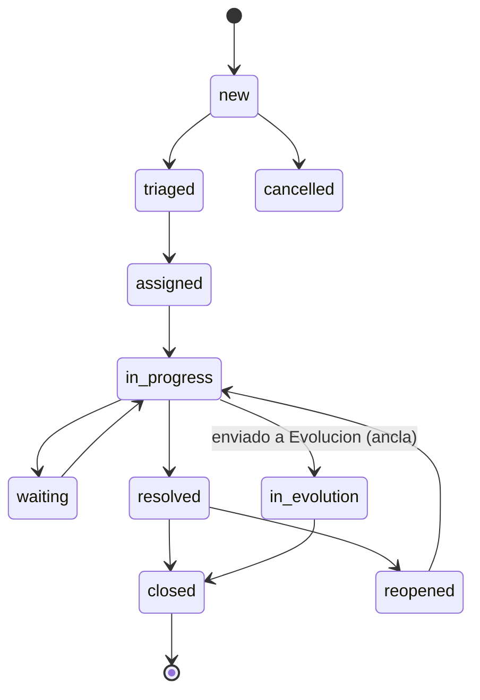
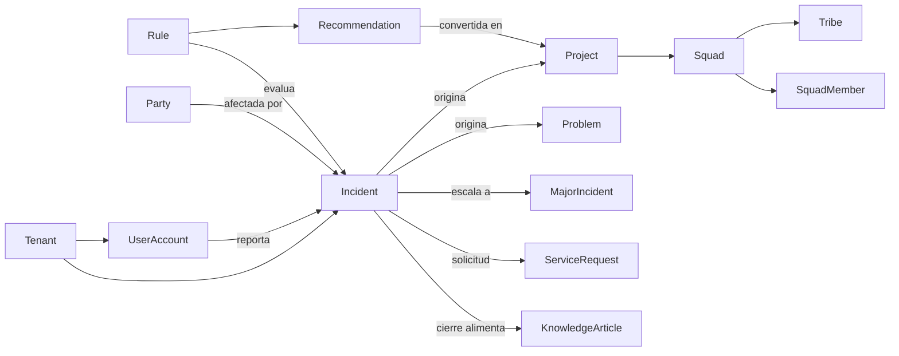
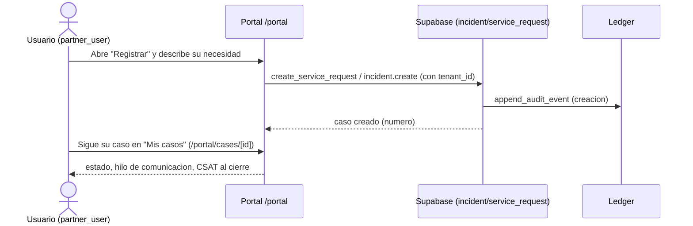

# CredixNexus — Documentación Funcional

## 1. Portada y control documental

| Campo | Valor |
|---|---|
| Documento | Documentación Funcional de CredixNexus |
| Aplicación | CredixNexus — Plataforma ITSM + Motor de Transformación (audit-grade) |
| Versión app | 0.1.0 (`package.json`) |
| Fecha de generación | 2026-07-31 |
| Repositorio | `C:\principal\credixnexus` (GitHub: `ignacioperez-ux/CredixNexus`) |
| Rama analizada | `docs/credixnexus-functional-technical-documentation` |
| Commit analizado | `a1826a2` |
| Responsable de generación | Ignacio Perez Rubio (Arquitecto) y el grupo de SQUADS a cargo |
| Estado del documento | Emitido — basado en evidencia del repositorio y del esquema real de Supabase |
| Alcance | Funcionalidad implementada verificable en código + base de datos productiva |
| Fuente de verdad | Código fuente (`app/`, `components/`, `lib/`), migraciones `sql/`, y esquema real de Supabase (proyecto `dffbysjrvvlwgzgakhaa`) |
| Limitaciones | El estado "Implementado" indica que existen ruta + componente + módulo de datos; no certifica que cada regla de negocio esté 100% completa (requeriría prueba funcional exhaustiva). Se marcan explícitamente las brechas detectadas (§4.15). |

> **Nota de stack:** el pedido original mencionaba "Vite"; el stack **real** verificado es **Next.js 16 (App Router) + React 19 + TypeScript + Tailwind v4 + Supabase (PostgreSQL 17)**. Se documenta la realidad, no el supuesto. Detalle en el documento técnico.

---

## 2. Resumen ejecutivo

**CredixNexus** es la plataforma interna de **gestión de servicios de TI (ITSM)** y **transformación** de Credix (fintech de crédito B2B). Su principio rector: *ningún incidente crítico debe quedar como simple ticket si revela una oportunidad estructural de mejora*. Por eso une, en una sola herramienta, la **mesa de ayuda** (incidentes, problemas, cambios), un **motor de reglas y scoring** que detecta candidatos a transformación, la **gestión de proyectos de evolución** (squads/tribus), **GRC** (riesgo, fraude, disputas, cumplimiento), y un **ledger inmutable** con encadenamiento por hash para auditoría.

- **Qué problema resuelve:** evita que el aprendizaje de cada incidente se pierda; conecta la operación diaria (Run) con la mejora estructural (Transform), manteniendo trazabilidad y comunicación con el cliente de extremo a extremo.
- **Usuarios:** personal interno de Credix (agentes y líderes de soporte, gerentes de evolución, miembros de squad, GRC, admin) y **usuarios finales** (rol `partner_user`) que registran y siguen sus casos en un portal de autoservicio.
- **Procesos que apoya:** registro/triage/resolución de incidentes, gestión de problemas y cambios, incidentes mayores, catálogo de servicios y solicitudes, base de conocimiento, priorización y ejecución de proyectos, gestión de talento y capacidad, riesgo/fraude/disputas, y auditoría inmutable.
- **Módulos principales:** Incidentes, Triage, Incidentes Mayores, Catálogo de Servicios, Portal de Autoservicio, Operaciones/SLA, Clientes, Riesgo, Fraude/Disputas, Evolución/Proyectos/Squads/Tribus, Talento/Carga, Conocimiento, IA, Reglas, Workflows, Analítica, CMDB/Dependencias, Procesos, Datos Maestros, Ledger, Administración/SSO.
- **Valor:** mesa de ayuda enterprise + motor de transformación con gobierno y auditoría de grado regulatorio, multi-tenant y bilingüe (ES/EN).
- **Partes completas:** el núcleo ITSM (incidentes/portal/knowledge/catálogo), RBAC por 16 roles, ledger inmutable, y la operación multi-persona están implementados y con datos reales (p.ej. 284 incidentes, 5.641 eventos de ledger).
- **Partes incompletas o a validar:** ruta `/partner` desconectada de la navegación (§4.15); varios módulos tienen estructura y datos de demostración pero baja volumetría (cambios, problemas, major incidents con 0 filas); la activación del SSO federado depende de configuración externa (día D).

---

## 3. Propósito y alcance funcional

- **Objetivo de la herramienta:** centralizar la gestión de incidentes y su conversión gobernada en mejoras/proyectos, con auditoría inmutable y comunicación cliente-céntrica.
- **Alcance actual (implementado):** ITSM (incident/problem/change/major incident), catálogo de servicios y solicitudes, portal de autoservicio del usuario final, base de conocimiento con ciclo de vida, motor de reglas/scoring, proyectos de evolución con squads/tribus y capacidad, GRC (riesgo/fraude/disputas), CMDB y dependencias, talento y carga, analítica operativa, workflows, y ledger de auditoría.
- **Procesos NO cubiertos / fuera de alcance:** no hay facturación ni core bancario (son sistemas externos referenciados como CMDB); el portal de **partner externo** (`/partner`) está desconectado de la navegación y pendiente de re-gating por `party` (§4.15).
- **Dependencias operativas:** Supabase (Auth + PostgreSQL + Storage + Edge Functions), API de Anthropic (IA), y hosting en Railway (despliegue desde `main`).
- **Supuestos identificados:** un único tenant operativo activo (`CORE`); la operación por defecto es en tema oscuro "Nexus" salvo el portal del usuario que usa tema claro.

---

## 4. Documentación funcional

### 4.4 Usuarios, perfiles y roles

Existen **16 roles** definidos en la base de datos (tabla `role`, seed en `sql/0012_seed_inventory.sql`, `sql/0069`, y grants incrementales). La autorización se resuelve por **permisos** (63 permisos en `permission`) mapeados a roles vía `role_permission`, y se consulta en tiempo de ejecución con la RPC `my_access()` (`lib/auth/session.ts:60`).

| Rol (code) | Descripción | Propósito | Estado |
|---|---|---|---|
| `system_admin` | Administrador del sistema | Admin técnico global (todos los permisos + bypass) | Implementado |
| `tenant_admin` | Administrador de tenant | Admin por tenant (bypass admin) | Implementado |
| `support_agent` | Agente de soporte ("Operador") | Gestiona **sus** incidentes; rutas `/mi-dia`, `/mis-casos`, `/cola-equipo` | Implementado |
| `support_lead` | Líder de soporte ("Gte. Operaciones") | Torre de control, escalamiento, cierre, RCA | Implementado |
| `product_owner` | Product Owner ("Gte. Evolución") | Prioriza y ejecuta proyectos de evolución | Implementado |
| `squad_member` | Miembro de Squad | Backlog/proyectos asignados; rutas `/mi-trabajo`, `/mi-squad`, `/mis-iniciativas` | Implementado |
| `change_manager` | Change Manager | Cambios y releases | Implementado |
| `grc_officer` | GRC Officer | Riesgo, cumplimiento, controles | Implementado |
| `business_owner` | Business Owner | Decisiones de negocio (aprobación de recomendaciones) | Parcialmente implementado (permisos dispersos, sin nav de persona propia) |
| `people_lead` | Líder de Personas/RRHH | Gestiona talento y capacidades | Parcialmente implementado (sin nav de persona propia) |
| `responsable_comercial` | Responsable Comercial | Decide/prioriza mejoras a Evolución | Parcialmente implementado |
| `auditor` | Auditor | Solo lectura + exportaciones | Implementado (permisos de lectura + `audit.export`) |
| `partner_user` | Usuario partner | Portal de autoservicio restringido | Implementado |
| `partner_admin` | Admin partner | Administra usuarios del partner | Configurado (acceso amplio acotado por RLS) — sin nav propia verificada |
| `ai_agent` | Agente IA | Identidad técnica de agente (solo lectura + `agent.execute`) | Implementado como identidad técnica |

**Matriz de acceso (resumen por capacidad; evidencia: tabla `role_permission` real).** "Administrar" = permisos `*.manage`/`user.manage`; "Aprobar" = `*.approve`/`recommendation.decide`/`project.validate`.

| Rol | Consultar | Crear | Editar | Eliminar (soft) | Aprobar | Administrar |
|---|:--:|:--:|:--:|:--:|:--:|:--:|
| system_admin | ✅ | ✅ | ✅ | ✅ | ✅ | ✅ |
| tenant_admin | ✅ | ✅ | ✅ | ✅ | ✅ | ✅ (tenant) |
| support_lead | ✅ | ✅ (incident) | ✅ | — | ✅ (change, project.validate) | ✅ (sla, change, workflow) |
| support_agent | ✅ (sus casos) | ✅ (incident) | ✅ (sus casos) | — | — | ✅ (worklog) |
| product_owner | ✅ | ✅ (project) | ✅ (project) | — | ✅ (change.approve) | ✅ (project, squad, talent) |
| squad_member | ✅ (project/squad/kb) | — | — | — | — | — |
| change_manager | ✅ | ✅ (change) | ✅ (change) | — | ✅ (change.approve) | ✅ (change, workflow, vendor) |
| grc_officer | ✅ | — | ✅ (risk/fraud/dispute) | — | ✅ (rule.approve) | ✅ (grc, fraud, dispute, risk) |
| auditor | ✅ (lectura amplia) | — | — | — | — | — (export) |
| partner_user | ✅ (KB/catálogo/sus casos) | ✅ (incident.create) | — | — | — | — |

- **Rol declarado vs implementado vs usado:** los 16 roles existen en BD; con evidencia de **uso real por nav de persona**: `support_agent`, `support_lead`, `product_owner`, `squad_member`, `partner_user` (overlays en `lib/nav/navigation.ts`) y admins. Sin nav de persona propia (usan MACRO_NAV o permisos): `change_manager`, `grc_officer`, `auditor`, `business_owner`, `people_lead`, `responsable_comercial`, `partner_admin`, `ai_agent`.
- **Segregación:** además de permisos, hay una **denylist por persona** (`ROLE_ROUTE_DENY` en `lib/nav/access.ts`) que impide a una persona interna abrir rutas fuera de su rol aunque conserve un permiso amplio. Solo aplica a usuarios de **una sola** persona interna; un usuario multi-persona es "power-user".

### 4.5 Mapa funcional de la aplicación

```mermaid
graph TD
  ROOT[CredixNexus]
  ROOT --> INI[Inicio: Dashboard / Workspace]
  ROOT --> TCK[Tickets]
  ROOT --> OPS[Operaciones]
  ROOT --> EVO[Evolucion]
  ROOT --> TAL[Talento]
  ROOT --> CON[Conocimiento e IA]
  ROOT --> ANA[Analitica]
  ROOT --> ADM[Administracion]
  ROOT --> POR[Portal Usuario]

  TCK --> INC[Incidentes]
  TCK --> TRI[Triage]
  TCK --> MI[Incidentes Mayores]
  TCK --> SC[Catalogo de Servicios]
  OPS --> TOW[Torre de Operaciones]
  OPS --> SLA[SLA / OLA]
  OPS --> CUS[Clientes]
  OPS --> FRD[Fraude / Disputas]
  OPS --> RSK[Riesgo]
  EVO --> PRJ[Proyectos + Portafolio]
  EVO --> SQD[Squads / Tribus]
  EVO --> PRB[Problemas]
  EVO --> CHG[Cambios]
  EVO --> CMDB[CMDB / Dependencias]
  EVO --> VEN[Vendors]
  CON --> KB[Knowledge Base]
  CON --> AI[AI Center]
  CON --> RUL[Reglas / Scoring]
  CON --> WF[Workflows]
  ADM --> USR[Usuarios y Roles]
  ADM --> SSO[Dominios SSO]
  ADM --> MD[Datos Maestros]
  ADM --> LED[Ledger Inmutable]
  ADM --> PRC[Procesos]
```



### 4.6 Descripción funcional por módulo

Cada ruta se ejecuta como Server Component autenticado (`getContext()` resuelve tenant + permisos). Estado = **Implementado** salvo indicación. Evidencia = ruta `app/(app)/<x>/page.tsx` + componente `components/<x>/` + datos `lib/<x>/queries.ts`/`actions.ts`.

#### Incidentes (`/incidents`)
- **Objetivo:** registrar, clasificar, asignar, resolver y cerrar incidentes; hub 360 de vínculos ITSM.
- **Usuarios:** support_agent (sus casos), support_lead, admins.
- **Funcionalidades:** listado maestro-detalle (`incidents/incident-split`) con **vistas guardadas** (`saved_view`), estadísticas (`incident-stats`), alta (`/incidents/new` → `incident-form`), edición (`/incidents/[id]/edit`), y **detalle 360** (`/incidents/[id]` → `incidents/detail/incident-detail`) que integra ~20 dominios: SLA, problemas, cambios, major incidents, vendors, worklog, CSAT, fraude, riesgo, tareas de caso, y **conversión a proyecto de Evolución**.
- **Flujo funcional:** el usuario abre la lista → filtra/usa una vista → abre un caso → ve estado, prioridad (derivada de impacto×urgencia), SLA, comentarios (`incident_comment`), trabajo (`case_work_log`), adjuntos (`case_attachment`) → ejecuta acciones (asignar, comentar, resolver con reporte que alimenta KB, escalar, enviar a Evolución) → cada mutación relevante genera un evento de ledger.
- **Reglas de negocio (evidencia):** prioridad derivada por `derive_priority(impact, urgency)`; **regla de asignación** (`lib/auth/incident-authz.ts`): solo el asignado o un gestor amplio (`incident.assign`/`triage.manage`) puede accionar un caso (backend-authoritative, error `ERR_NOT_ASSIGNEE`); al resolver se exige reporte de solución (memoria de proyecto) y evidencia.

#### Triage (`/triage`, perm `triage.manage`)
- Cola de clasificación de casos en `intake_status='pending'`; el triador clasifica (`classified_as`), descarta con razón, o admite. Marca `triaged_by`/`triaged_at`. Estado: Implementado.

#### Incidentes Mayores (`/major-incidents`, perm `major_incident.read`)
- Sala de MI: comandante (`commander_user_id`) y líder de comunicaciones (`comms_lead_user_id`), bitácora de updates (`major_incident_update`), evidencia (`major_incident_evidence`). Edición gateada por `isMiEditable` (solo cuando corresponde). Estado: Implementado; volumetría de demostración baja (0 filas actuales).

#### Catálogo de Servicios y Solicitudes (`/service-catalog`, perm `service_catalog.read`)
- Ítems de catálogo (`service_item`) por categoría; el usuario solicita → se crea `service_request` **ligada a un `incident`** (RPC `create_service_request`), con `form_data` (JSONB), `sla_due_at`, y opcional `workflow_instance_id`. Detalle en `/service-catalog/requests/[id]`.

#### Portal de Autoservicio (`/portal`, sin permiso — hub del usuario final)
- **Centro de la herramienta cliente-céntrica.** Hub con pestañas (`inicio` / `autoservicio` / `miscasos` / `registrar`) para el rol `partner_user`. Registra casos, consulta el catálogo, y ve **sus** casos (`/portal/cases/[id]` con hilo de comunicación, encuesta CSAT y adjuntos). El sidebar del portal es plano con CTA de "Registrar" y badge con nº de casos activos (`getMyActiveCaseCount`). Estado: Implementado.

#### Operaciones / SLA / Clientes / Riesgo / Fraude
- **Torre de Operaciones** (`/operaciones`): tablero unificado de la operación (KPIs, colas).
- **SLA/OLA** (`/sla-governance`): casos en riesgo, reglas y eventos de escalamiento (`escalation_rule`/`escalation_event`), OLA (`ola_policy`).
- **Clientes** (`/customers`, `/customers/[id]`): vista Cliente 360.
- **Riesgo** (`/risk`): eventos de riesgo GRC (`risk_event`).
- **Fraude/Disputas** (`/fraud-disputes`): casos de fraude (`fraud_case`) y disputas (`dispute_case`), cada uno ligado a un incidente.

#### Evolución / Proyectos / Squads / Tribus
- **Home de Evolución** (`/evolucion`): decisiones, ROI y capacidad de tribus.
- **Proyectos** (`/projects`): Kanban con priorización **WSJF** (business_value, time_criticality, risk_reduction, job_size) y ROI; alta/edición; detalle con tareas (`project_task`), validaciones (`project_validation`), squads (`project_squad`), riesgos (`project_risk`) y **caso ancla** (incidente origen). Portafolio (`/projects/portafolio`) con capacidad.
- **Squads/Tribus** (`/squads`, `/evolucion/mapa`): roster (`squad_member`), leads (PO/tech/agile), tipo de squad (domain/transversal), capacidad (`capacity_points`), y tribus (`tribe`).

#### Conocimiento / IA / Reglas / Workflows
- **Knowledge Base** (`/knowledge`): artículos (`knowledge_article`) con versiones (`knowledge_article_version`), feedback (`knowledge_feedback`), eventos de vista/deflexión (`knowledge_event`), y **tablero de revisión** (`/knowledge/revision`). Los artículos pueden originarse de incidentes, problemas, cambios, proyectos o major incidents (captura al cierre).
- **AI Center** (`/ai-center`): interacciones agénticas gobernadas (`agent_action`) — prompt, modelo, input/output, confianza y revisión humana.
- **Reglas/Scoring** (`/rules`): motor de reglas versionadas (`rule`/`rule_version`/`rule_evaluation`) + cola de recomendaciones (`project_recommendation`).
- **Workflows** (`/workflows`): definiciones (`workflow_definition` + nodos/aristas) e instancias (`workflow_instance`/`workflow_step`), con RPCs `start_workflow`/`advance_workflow_step`.

#### Administración / GRC / CMDB / Datos Maestros / Ledger
- **Admin** (`/admin`, perm `user.manage`): hub de usuarios y roles (RPCs `admin_list_users`, `admin_set_user_roles`, `admin_set_user_status`).
- **Dominios SSO** (`/admin/sso-domains`): gestión de dominios corporativos para aprovisionamiento federado (ver documento técnico y `docs/auth/SSO_ACTIVE_DIRECTORY_PLAN.md`).
- **Datos Maestros** (`/catalog`): CRUD genérico de catálogos declarados en `lib/masterdata/registry.ts` (unidades de negocio, productos, canales, skills, categorías de incidente, squads, procesos, sistemas/CMDB, tipos de CI, tipos de caso, macros, ítems de gobierno).
- **CMDB/Dependencias** (`/cmdb`, `/dependencies`): inventario de CIs (`configuration_item`) y grafo de relaciones (`ci_relationship`).
- **Ledger Inmutable** (`/ledger`, perm `audit.read`): visor del ledger encadenado por hash (`immutable_audit_event`), con verificación de cadena (`verify_audit_chain`).

### 4.6.b Estados y transiciones — Incidente (evidencia: enum `incident_status`)



- Estados: `new, triaged, assigned, in_progress, waiting, resolved, closed, reopened, cancelled, in_evolution`.
- `in_evolution` es el estado **ancla**: la incidencia que pasa a un proyecto de Evolución NO se cierra; mantiene el tracking y la comunicación con el cliente (principio cliente-céntrico).
- Quién cambia el estado: el asignado o un gestor amplio (`lib/auth/incident-authz.ts`); las transiciones están validadas (`lib/incidents/transitions.ts`, con pruebas unitarias).

### 4.6.c Reglas de negocio (muestra verificada)

| ID | Regla | Módulo | Evidencia | Estado |
|---|---|---|---|---|
| RN-01 | Prioridad = f(impacto, urgencia) | Incidentes | `derive_priority()` (SQL), enum `priority_level` | Implementado |
| RN-02 | Solo el asignado o un gestor amplio puede accionar un caso | Incidentes | `lib/auth/incident-authz.ts` (`ERR_NOT_ASSIGNEE`) | Implementado |
| RN-03 | Al resolver se exige reporte de solución + evidencia | Incidentes | `lib/incidents/actions.ts`, `sql/0119_closure_kb_capture` | Implementado |
| RN-04 | Toda mutación relevante genera evento de ledger | Transversal | trigger `audit_row_change` + `append_audit_event` (hash-chain) | Implementado |
| RN-05 | Incidencia enviada a Evolución queda como ancla (`in_evolution`) | Incidentes/Evolución | enum `incident_status`, `sql/0098_converted_cases` | Implementado |
| RN-06 | Priorización de proyectos por WSJF | Proyectos | columnas `business_value/time_criticality/risk_reduction/job_size/wsjf` | Implementado |
| RN-07 | Aislamiento estricto por tenant (RLS) | Transversal | 88/88 tablas con RLS + policy por `tenant_id` | Implementado |
| RN-08 | Reglas de scoring/transformación versionadas e inmutables | Reglas | `rule_version` (append-only) | Implementado |
| RN-09 | SSO federado solo aprovisiona `partner_user` por dominio permitido | Auth/SSO | `handle_new_user()` JIT + `sso_allowed_domain` | Implementado (BD); activación pendiente (día D) |

### 4.7 Catálogo de pantallas (resumen)

Hay **84 páginas** (`page.tsx`). Tabla resumida por módulo (rutas de detalle/edición agrupadas):

| Pantalla | Ruta | Módulo | Propósito | Rol/perm | Estado |
|---|---|---|---|---|---|
| Dashboard | `/dashboard` | Inicio | Centro de mando + KPIs | `incident.read` | Implementado |
| Workspace | `/workspace` | Inicio | Workspace del agente | `incident.read` | Implementado |
| Incidentes | `/incidents` (+`/new`,`/[id]`,`/[id]/edit`) | Tickets | Gestión de incidentes | `incident.read` | Implementado |
| Triage | `/triage` | Tickets | Cola de clasificación | `triage.manage` | Implementado |
| Incidentes Mayores | `/major-incidents` (+`/[id]`) | Tickets | Sala de MI | `major_incident.read` | Implementado |
| Catálogo de Servicios | `/service-catalog` (+`/requests/[id]`) | Tickets | Catálogo + solicitudes | `service_catalog.read` | Implementado |
| Portal | `/portal` (+`/cases/[id]`) | Portal | Autoservicio del usuario | (sin perm) | Implementado |
| Torre Ops | `/operaciones` | Operaciones | Torre de control | `incident.read` | Implementado |
| SLA/OLA | `/sla-governance` | Operaciones | Gobierno SLA | `sla.read` | Implementado |
| Clientes | `/customers` (+`/[id]`) | Operaciones | Cliente 360 | `incident.read` | Implementado |
| Fraude/Disputas | `/fraud-disputes` (+detalles) | Operaciones | Fraude + disputas | `fraud.read`/`dispute.read` | Implementado |
| Riesgo | `/risk` | Operaciones | Eventos de riesgo | `risk.read` | Implementado |
| Evolución | `/evolucion` (+`/mapa`) | Evolución | Home + mapa tribus | `project.read`/`squad.read` | Implementado |
| Proyectos | `/projects` (+`/new`,`/[id]`,`/portafolio`) | Evolución | Kanban + portafolio | `project.read` | Implementado |
| Casos Convertidos | `/casos-convertidos` | Evolución | Anclas incidente→evolución | `project.read`+`incident.read` | Implementado |
| Problemas | `/problems` (+`/new`,`/[id]`) | Evolución | Gestión de problemas | `problem.read` | Implementado (0 filas) |
| Cambios | `/changes` (+`/new`,`/[id]`) | Evolución | Gestión de cambios | `change.read` | Implementado (0 filas) |
| Squads | `/squads` (+`/[id]`) | Evolución | Squads + capacidad | `squad.read` | Implementado |
| Observabilidad | `/observability` | Evolución | Alertas + DX | `observability.read` | Implementado |
| Dependencias | `/dependencies` | Evolución | Grafo CMDB | `cmdb.read` | Implementado |
| Vendors | `/vendors` (+`/[id]`,`/new`) | Evolución | Proveedores + scorecard | `vendor.read` | Implementado |
| Talento | `/talent` (+`/[id]`) | Talento | Perfiles + carga | `talent.read` | Implementado |
| Carga/Workload | `/workload` | Talento | Carga + simulación | `squad.read` | Implementado |
| Áreas de Entrega | `/delivery-areas` | Talento | Maestro de áreas | `area.read` | Implementado |
| Knowledge | `/knowledge` (+`/[id]`,`/revision`) | Conocimiento | KB + revisión | `knowledge.read` | Implementado |
| AI Center | `/ai-center` | Conocimiento | Interacciones IA | `incident.read`+`ai.read` | Implementado |
| Reglas | `/rules` | Conocimiento | Motor de reglas | `rule.read` | Implementado |
| Workflows | `/workflows` (+detalles) | Conocimiento | Instancias/definiciones | `workflow.read` | Implementado |
| Analítica | `/analytics` (+`/comportamiento`) | Analítica | Analítica operativa | `incident.read`+`analytics.read` | Implementado |
| Admin | `/admin` | Administración | Usuarios y roles | `user.manage` | Implementado |
| Dominios SSO | `/admin/sso-domains` | Administración | Dominios SSO (JIT) | `user.manage` | Implementado |
| Datos Maestros | `/catalog` (+`/[catalog]/*`) | Administración | CRUD de catálogos | `masterdata.manage` | Implementado |
| Procesos | `/processes` (+`/[id]`) | Administración | Gobierno de procesos | `process.read` | Implementado |
| CMDB | `/cmdb` | Administración | Inventario de CIs | `cmdb.read` | Implementado |
| Ledger | `/ledger` | Administración | Ledger inmutable | `audit.read` | Implementado |
| Rutas personales | `/mi-dia`,`/mis-casos`,`/cola-equipo`,`/mi-desempeno`,`/mi-trabajo`,`/mi-squad`,`/mis-iniciativas`,`/mi-perfil`,`/notificaciones` | Personas | Vistas por persona (operador/squad) | por rol | Implementado |
| Partner | `/partner` | (huérfana) | Portal partner externo | — | **Desconectado de nav (§4.15)** |

### 4.8 Datos desde la perspectiva del usuario (entidades reales)

Entidades funcionales verificadas (tablas reales). Cada una lleva `tenant_id` (aislamiento) y auditoría (`created_at/by`, `updated_at/by`).

| Entidad | Qué representa | Estados | Relaciones principales |
|---|---|---|---|
| `incident` | Caso/ticket (incidente, request, fraude, disputa…) — **hub central** | `incident_status` (10 estados) | reportado por `user_account`, afecta `party`/`configuration_item`/`service`/`product`/`process`; origen de `project`, `problem`, `major_incident`, `service_request` |
| `user_account` | Cuenta de usuario (interno o partner) | `record_status` | pertenece a `tenant`; opcional `party`; tiene `user_role` |
| `tenant` | Organización/modo operativo (`operating_mode`) | `record_status` | raíz multi-tenant de todas las tablas |
| `party` / `party_role` | Persona/organización/sistema y su rol de negocio | — | afectada por incidentes; vinculada a cuentas |
| `project` | Proyecto/iniciativa de evolución | `project_status` | creado desde `incident`/`recommendation`/`rule_evaluation`; tiene `project_task`, `project_squad`, `project_risk`, `project_validation` |
| `squad` / `tribe` | Equipo ágil y su agrupación | `record_status` | tiene `squad_member`; pertenece a `tribe`; ejecuta `project` |
| `knowledge_article` | Artículo de base de conocimiento | `record_status` | versiones, feedback, eventos; originado por incidente/problema/cambio/proyecto/MI |
| `service_item` / `service_request` | Ítem de catálogo y su solicitud | request `status` | solicitud liga a `incident` |
| `problem` / `change_request` / `major_incident` | Problema, cambio, incidente mayor | (varios) | ligados a incidentes/CIs |
| `configuration_item` | Elemento de configuración (sistema/servicio) | `record_status` | relaciones `ci_relationship`; usado por incidentes/procesos |
| `rule` / `rule_version` / `rule_evaluation` | Motor de reglas/scoring versionado | (approval/record) | evalúa incidentes; genera recomendaciones |
| `immutable_audit_event` | Evento de ledger inmutable (hash-chain) | append-only | referencia `tenant`, actor, entidad |

### 4.9 Relaciones funcionales



- Un `tenant` tiene muchas cuentas, incidentes y todas las entidades operativas.
- Un `incidente` puede originar un problema, un cambio, un incidente mayor, una solicitud de servicio y un proyecto de evolución (relación 1→N documentada por FKs reales).
- Un `squad` pertenece a una `tribe` y tiene varios miembros; ejecuta varios proyectos.
- Un `usuario` puede tener uno o varios roles (`user_role`).

### 4.10 Reportes, dashboards e indicadores

| Dashboard/Reporte | Ruta | Origen de datos | Indicadores | Estado |
|---|---|---|---|---|
| Command Center | `/dashboard` | RPC `dashboard_counts`, `analytics_overview`, `supervisor_metrics` | KPIs de casos, SLA, supervisor | Implementado (datos reales) |
| Torre de Operaciones | `/operaciones` | `lib/operations/queries`, `analytics/queries` | Colas, carga, SLA | Implementado |
| Analítica | `/analytics` | RPC `analytics_overview`, `performance_metrics`, `recurrence_analytics` | Rendimiento, tendencias, recurrencia | Implementado |
| Comportamiento | `/analytics/comportamiento` | RPC `incident_behavior_analysis` | Patrones/recurrencia | Implementado |
| Portafolio | `/projects/portafolio` | `lib/projects/queries`, `lib/capacity/queries` | Capacidad, ROI, WSJF | Implementado |
| Vendor Scorecard | `/vendors/[id]` | RPC `vendor_scorecard` | Desempeño de proveedor | Implementado |
| Ledger | `/ledger` | RPC `verify_audit_chain`, `getLedger` | Integridad de cadena | Implementado (5.641 eventos reales) |

- **Datos reales vs simulados:** los indicadores se calculan sobre datos reales de la BD (RPCs de agregación). El repositorio incluye datos de **demostración/seed** (`sql/seed/`) que pueblan tenant `CORE` con personas sintéticas y casos; no son "mocks de UI" sino datos de BD. Componentes `analytics-unavailable` muestran estado vacío cuando no hay datos suficientes (no simulan valores). No se detectaron valores de KPI hardcodeados en el frontend.

### 4.11 Notificaciones y automatizaciones

| Elemento | Implementación | Estado |
|---|---|---|
| Campanita de notificaciones | `components/app-shell/notification-bell.tsx` + tabla `notification` + RPC `notify_role` | Implementado |
| Página "Mis notificaciones" | `/notificaciones` | Implementado |
| Escalamiento automático SLA | tabla `escalation_rule`/`escalation_event` + RPC `evaluate_escalations` | Implementado (motor); disparo periódico externo no verificado en repo |
| Auditoría automática (ledger) | triggers `audit_row_change`/dedicados en todas las tablas de negocio (149 triggers) | Implementado |
| Reclasificación de squads | trigger (`sql/0104_squad_auto_reclassify`) | Implementado |
| Correo/email saliente | **No verificado** en el repositorio (no se encontró proveedor de correo) | No verificado |
| Realtime (websockets) | **No verificado** uso de Supabase Realtime en el frontend | No verificado |

### 4.12 Validaciones y mensajes

- Validación en capas: BD (constraints/checks/FK/unique + RLS), servicio/servidor (server actions con `hasPermission` + validadores `lib/<dominio>/validation.ts`), y frontend (formularios). Evidencia: ~20 archivos `*/validation.test.ts`.
- Datos maestros: control de duplicados en tres capas (BD unique, servicio, formulario) con mensaje que indica el registro existente (`lib/masterdata/actions.ts`, error `DUPLICATE`).
- Mensajes de error i18n (`err.*`), éxito por operación, y confirmaciones críticas (p.ej. desactivar dominio SSO). Copy visible sale de `lib/i18n/dictionaries.ts` (ES/EN).

### 4.13 Flujos funcionales end-to-end

**Flujo A — Usuario registra un caso (autoservicio):**


**Flujo B — Incidente → Transformación (Run → Transform):**
```mermaid
sequenceDiagram
  actor A as Agente/Lider
  participant I as Incidente
  participant R as Motor de Reglas
  participant E as Evolucion
  A->>I: Gestiona y detecta oportunidad estructural
  R->>I: Scoring de transformacion (transformation_score/candidate)
  A->>I: "Enviar a Evolucion"
  I->>I: estado -> in_evolution (ancla, no se cierra)
  I->>E: crea Project (created_from_incident_id) + squad
  E-->>A: seguimiento; comunicacion cliente sobrevive
```

Para cada flujo: participantes, precondiciones (permiso + asignación), decisiones (aprobar/priorizar), excepciones (sin permiso → `ERR_*`), resultado (entidad creada), y tablas/pantallas relacionadas quedan documentados arriba.

### 4.14 Matriz de trazabilidad funcional (muestra)

| ID | Módulo | Función | Pantalla | Ruta | Componente | Tabla/fuente | Estado |
|---|---|---|---|---|---|---|---|
| F-INC-01 | Incidentes | Listar/gestionar | Lista | `/incidents` | `incidents/incident-split` | `incident` + `lib/incidents/queries` | Implementado |
| F-INC-02 | Incidentes | Resolver con KB | Detalle | `/incidents/[id]` | `incidents/detail/incident-detail` | `incident`, `knowledge_article` | Implementado |
| F-POR-01 | Portal | Registrar caso | Hub | `/portal` | `portal/portal` | `service_request`,`incident` (RPC `create_service_request`) | Implementado |
| F-EVO-01 | Evolución | Priorizar proyectos | Kanban | `/projects` | `projects/kanban` | `project` (WSJF) | Implementado |
| F-KB-01 | Conocimiento | Revisar KB | Tablero | `/knowledge/revision` | `knowledge/kb-review-board` | `knowledge_article` | Implementado |
| F-ADM-01 | Administración | Gestionar roles | Hub | `/admin` | `admin/admin-hub` | `user_role` (RPC `admin_set_user_roles`) | Implementado |
| F-SSO-01 | Administración | Dominios SSO | Admin | `/admin/sso-domains` | `admin/sso-domains-admin` | `sso_allowed_domain` | Implementado |
| F-LED-01 | Auditoría | Verificar cadena | Visor | `/ledger` | `ledger/ledger-view` | `immutable_audit_event` (RPC `verify_audit_chain`) | Implementado |

### 4.15 Hallazgos y brechas funcionales

| ID | Hallazgo | Impacto | Evidencia | Severidad | Recomendación (no implementada) |
|---|---|---|---|---|---|
| HF-01 | Ruta `/partner` desconectada de la navegación (item `nav.partner` retirado) pero accesible por URL directa y **sin entrada en `ROUTE_PERMISSIONS`** | Cualquier autenticado podría abrirla; código de UI "muerto" | `app/(app)/partner/page.tsx`, comentario UX-007 en `lib/nav/navigation.ts` | Media | Añadir guard de permiso o retirar la ruta hasta re-gating por `party` |
| HF-02 | Módulos con estructura completa pero volumetría 0 (Cambios, Problemas, Major Incidents, muchos GRC) | La funcionalidad no se ejercita con datos; difícil validar reglas | conteo de filas (0) en `change_request`, `problem`, `major_incident` | Baja | Poblar con datos de prueba o confirmar uso real |
| HF-03 | Roles `business_owner`, `people_lead`, `responsable_comercial`, `partner_admin` sin navegación de persona propia | Acceden vía permisos/MACRO_NAV pero sin experiencia dedicada | `lib/nav/navigation.ts` (no hay overlay) | Baja | Definir overlay de persona si el rol se usará |
| HF-04 | Activación de SSO federado depende de configuración externa (Entra ID + Supabase + flag) | La función de login corporativo no está activa hasta el "día D" | `docs/auth/SSO_ACTIVE_DIRECTORY_PLAN.md`, flag `NEXT_PUBLIC_SSO_ENABLED` | Baja (esperado) | Ejecutar runbook del día D |
| HF-05 | Correo saliente y Realtime no verificados | Notificaciones son in-app; sin evidencia de email/push | grep del repo | Informativa | Confirmar si el negocio requiere email |

### 4.16 Glosario funcional

- **ITSM:** gestión de servicios de TI (ITIL 4: incident/problem/change/knowledge/SLA).
- **Run / Transform:** operación diaria (Run) vs mejora estructural/proyectos (Transform).
- **Tenant:** organización y su modo operativo (`operating_mode` ∈ saas/bpo/enterprise/internal/marketplace). No es un producto ni un rol.
- **Party / party_role:** quién participa (persona/organización/sistema) y su rol de negocio (originator, investor, buyer, merchant…).
- **Ledger inmutable:** bitácora append-only con encadenamiento por hash (audit-grade).
- **WSJF:** Weighted Shortest Job First — método de priorización de proyectos.
- **Ancla (in_evolution):** estado del incidente que pasó a Evolución sin cerrarse, para conservar tracking y comunicación con el cliente.
- **Squad / Tribe / Chapter:** estructura ágil de la organización de evolución.
- **CMDB / CI:** base de datos de configuración e ítems de configuración (sistemas/servicios).
- **RLS:** Row-Level Security — aislamiento por tenant a nivel de base de datos.
