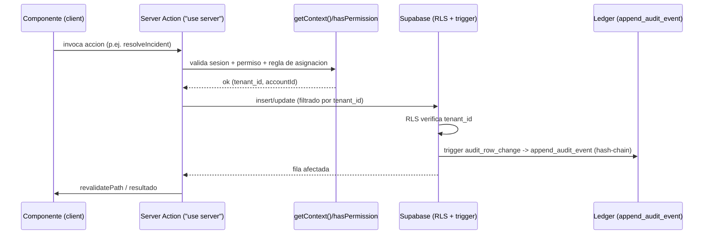
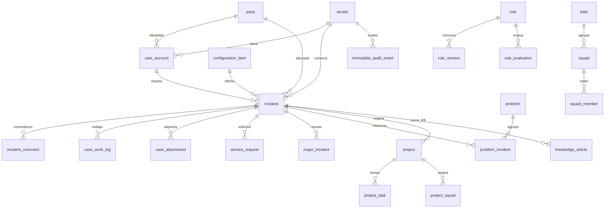
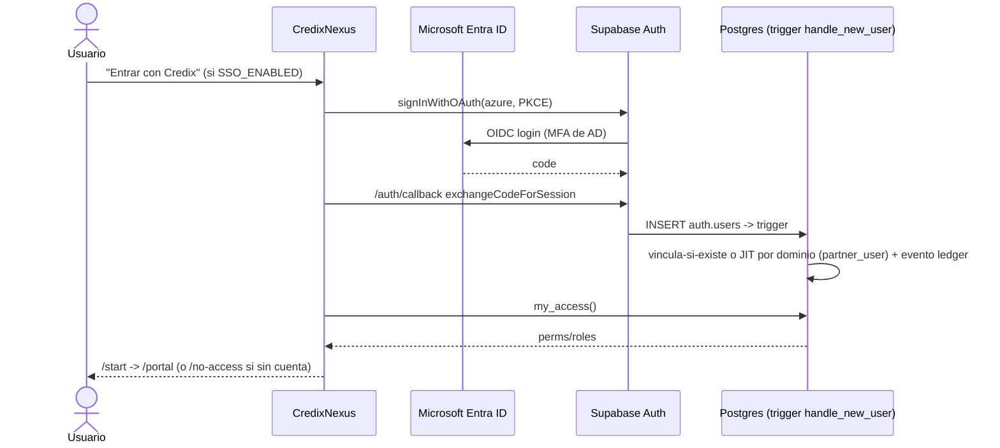

# CredixNexus — Documentación Técnica

## 5.1 Portada y control documental

| Campo | Valor |
|---|---|
| Documento | Documentación Técnica de CredixNexus |
| Aplicación | CredixNexus — Plataforma ITSM + Motor de Transformación (audit-grade) |
| Versión app | 0.1.0 (`package.json`) |
| Fecha de generación | 2026-07-31 |
| Repositorio | `ignacioperez-ux/CredixNexus` |
| Rama analizada | `docs/credixnexus-functional-technical-documentation` |
| Commit analizado | `a1826a2` |
| Responsable de generación | Ignacio Perez Rubio (Arquitecto) y el grupo de SQUADS a cargo |
| Estado | Emitido — basado en código + esquema real de Supabase (`dffbysjrvvlwgzgakhaa`, PostgreSQL 17) |
| Fuente de verdad | `app/`, `components/`, `lib/`, `sql/`, `supabase/`, configuración del repo, e `information_schema`/catálogos de Postgres del proyecto productivo |
| Limitaciones | Se marcan "No verificado" los elementos sin evidencia directa. No se modificó ningún archivo funcional. |

> **Corrección de stack:** el pedido mencionaba "Vite"; el stack real es **Next.js 16 (App Router) + React 19**. Vite **no** es el bundler de la app; `@vitejs/plugin-react` aparece solo como dependencia de **Vitest** (pruebas). No existe `src/`; el árbol es App Router en la raíz (`app/`, `components/`, `lib/`).

---

## 5.2 Resumen técnico

CredixNexus es un **monolito modular** Next.js sobre Supabase, no una arquitectura de microservicios (la spec de ~20 servicios se materializa como módulos de app + esquema/funciones Postgres — CLAUDE.md §0.1).

- **Frontend + API:** Next.js 16 App Router (React Server Components + Server Actions), React 19, TypeScript, Tailwind v4.
- **Backend:** lógica en Server Components/Actions (`"use server"`) + PostgreSQL (funciones PL/pgSQL, RPCs, triggers) + una Edge Function (embeddings).
- **Base de datos:** Supabase PostgreSQL 17 — 88 tablas, 117 funciones, 149 triggers, 93 políticas RLS, 0 vistas. **RLS en el 100% de las tablas.**
- **Auth:** Supabase Auth (email/password + OIDC Azure/Entra ID), `@supabase/ssr` con refresh vía middleware.
- **Autorización:** RBAC por permisos (RPC `my_access`) + bypass admin + denylist por persona en el guard de rutas + RLS por `tenant_id` en BD.
- **Integraciones:** Anthropic Claude (IA gobernada), Supabase Storage (adjuntos), embeddings on-platform (gte-small).
- **Despliegue:** Railway (build automático desde git `main`). **Observabilidad/monitoreo externo:** no verificado en repo.

---

## 5.3 Stack tecnológico

| Componente | Tecnología | Versión | Uso | Evidencia |
|---|---|---|---|---|
| Framework | Next.js | ^16.2.10 | App Router, RSC, Server Actions, middleware | `package.json`, `next.config.ts` |
| UI | React / React DOM | ^19.0.0 | Componentes | `package.json` |
| Lenguaje | TypeScript | ^5.7.0 | Tipado estricto (`strict`, `moduleResolution: bundler`) | `tsconfig.json` |
| Estilos | Tailwind CSS + @tailwindcss/postcss | ^4.0.0 | Design system por tokens (`app/globals.css`) | `postcss.config.mjs` |
| Backend BaaS | @supabase/supabase-js | ^2.110.2 | Cliente de datos/auth | `lib/supabase/*` |
| SSR/cookies | @supabase/ssr | ^0.7.0 | Cliente server + middleware de sesión | `lib/supabase/{server,middleware}.ts` |
| Base de datos | PostgreSQL (Supabase) | 17 | Datos, RLS, funciones, triggers | migraciones `sql/`, MCP |
| Pruebas unit | Vitest (+ @vitejs/plugin-react, jsdom, Testing Library) | ^4.1.10 | `lib/**/*.test.ts`, `components/**/*.test.tsx` | `vitest.config.mts` |
| Pruebas E2E | @playwright/test | ^1.61.1 | Flujos por rol | `playwright.config.ts` |
| Lint | ESLint (+ eslint-config-next) | ^9.0.0 | Flat config | `eslint.config.mjs` |
| IA | Anthropic Claude (HTTP directo) | modelo `claude-sonnet-5` | Clasificación, RCA, resúmenes, KB | `lib/ai/anthropic.ts` |
| Fuentes | next/font/google (Heebo, Inter, Jakarta, JetBrains/Plex Mono) | — | Tipografía self-hosted | `app/layout.tsx` |

---

## 5.4 Arquitectura de solución

### Arquitectura general

```mermaid
flowchart TD
  subgraph Cliente
    B[Navegador - React 19]
  end
  subgraph NextJS[Next.js 16 en Railway]
    MW[proxy.ts / middleware updateSession]
    RSC[Server Components]
    SA[Server Actions use server]
    LAY[app app layout - guards]
  end
  subgraph Supabase
    AUTH[Supabase Auth - JWT/OIDC]
    PG[(PostgreSQL 17 - RLS, RPC, triggers)]
    ST[Storage - buckets]
    EF[Edge Function embed]
  end
  ANTH[Anthropic Claude API]

  B <--> MW
  MW --> LAY
  LAY --> RSC
  B -->|form / action| SA
  RSC -->|@supabase/ssr| PG
  SA -->|@supabase/ssr| PG
  SA --> ST
  SA -->|HTTP| ANTH
  SA -->|invoke| EF
  EF --> PG
  MW <--> AUTH
  RSC --> AUTH
```

### Flujo de una operación típica (mutación con Server Action)



**Patrones identificables:** RSC-first (lectura en el servidor), Server Actions para mutaciones, capa de dominio `lib/<dominio>/{queries,actions,validation}.ts`, guard de rutas centralizado (`lib/nav/access.ts`), auditoría por trigger, y defensa en profundidad (permiso en app + RLS en BD).

---

## 5.5 Estructura del repositorio

| Ruta | Propósito | Tipo |
|---|---|---|
| `app/(app)/` | Rutas privadas (84 páginas) por módulo de dominio | Rutas + Server Components |
| `app/(auth)/` | Login, no-access | Rutas de auth |
| `app/auth/callback/` | Retorno OAuth (Entra ID) | Route handler |
| `app/page.tsx` | Landing/login público | Página |
| `app/layout.tsx` | Root layout (fuentes, ThemeProvider, I18nProvider) | Layout |
| `components/` | 179 componentes por dominio + `app-shell/` + `ui/` (base DS) | React |
| `lib/` | Capa de dominio (47 subcarpetas), `supabase/`, `auth/`, `nav/`, `i18n/`, `ai/` | Lógica/datos |
| `sql/` | 127 migraciones (`0001`→`0133`) + `sql/seed/` (datos de rama) | SQL |
| `supabase/functions/embed/` | Edge Function de embeddings (Deno) | Edge |
| `e2e/` | Pruebas Playwright + setup por rol | Tests |
| `design-system/` | Tokens del DS Credix (generados desde Figma) | Assets/tokens |
| `docs/` | Documentación (este documento incluido) | Docs |
| `proxy.ts` | Entry del middleware (delega en `updateSession`) | Middleware |

```
app/
├── (app)/            # 84 páginas privadas por módulo
├── (auth)/           # login, no-access
├── auth/callback/    # retorno OIDC
├── layout.tsx  page.tsx  globals.css
components/           # 179 componentes (app-shell, ui, <dominio>)
lib/                  # 47 dominios + supabase/ auth/ nav/ i18n/ ai/
sql/                  # 127 migraciones + seed/
supabase/functions/embed/
e2e/                  # Playwright
```

---

## 5.6 Routing y navegación

- **Librería:** enrutado nativo de Next.js App Router (basado en archivos). No hay react-router.
- **Rutas privadas:** todo bajo `app/(app)/` — protegido por `app/(app)/layout.tsx`.
- **Rutas públicas:** `/` (landing/login), `/login`, `/auth/callback`, `/no-access`, `/unauthorized`.
- **Guard (doble candado, `app/(app)/layout.tsx`):**
  1. **Permiso:** `requiredPermForPath(pathname)` (mapa `ROUTE_PERMISSIONS`, prefijo más específico) + `canSeeNav` → si falla, `redirect("/unauthorized")`.
  2. **Denylist por persona:** `isRouteDeniedForRoles(pathname, roles)` (`ROLE_ROUTE_DENY`) para una sola persona interna (admin exento).
- **Middleware:** `proxy.ts` → `updateSession` refresca el token e inyecta `x-pathname`. Matcher: todo salvo estáticos/imágenes.
- **Redirecciones:** `defaultHome()` por rol; `/unauthorized` como destino de denegación.

| Ruta (ejemplos) | Componente | Protección | Perm |
|---|---|---|---|
| `/dashboard` | `dashboard/command-center` | Privada | `incident.read` |
| `/incidents/[id]` | `incidents/detail/incident-detail` | Privada + regla asignación | `incident.read` |
| `/portal` | `portal/portal` | Privada (sin perm) | — |
| `/admin/sso-domains` | `admin/sso-domains-admin` | Privada + `isAdmin` (redirect) | `user.manage` |
| `/unauthorized` | `app-shell/unauthorized` | Privada | — |

Detalle completo del árbol de navegación (MACRO_NAV de 8 categorías, overlays por persona, portal plano) en el documento funcional §4.5 y en `lib/nav/navigation.ts`.

---

## 5.7 Componentes y módulos frontend

- **App-shell** (`components/app-shell/`): `sidebar.tsx` (nav filtrada por permiso, colapsables persistentes, rama portal), `header.tsx` (título por ruta, CTA por rol, buscador, toggles tema/idioma, campanita, signout), `command-menu.tsx` (Ctrl/Cmd+K), `notification-bell.tsx`, `help-fab.tsx`, `nav-history-provider.tsx`/`page-back.tsx`, `wordmark.tsx`, `unauthorized.tsx`.
- **UI base** (`components/ui/`): set del Design System Credix — `button`, `card`, `page-header`, `status-badge`, `field`, `empty-state`, `icon` (más `index.ts` barrel).
- **Providers:** `components/theme-provider.tsx` (temas `nexus`/`claro` vía `data-theme`), `lib/i18n/provider.tsx` (ES/EN).

Matriz módulo → página → componentes → hooks/estado → servicios → tablas (muestra; ver §5.10 para el resto):

| Módulo | Página | Componentes | Servicios (lib) | Tablas |
|---|---|---|---|---|
| Incidentes | `/incidents` | `incident-split`, `incident-stats` | `incidents/queries`,`actions` | `incident`, `incident_comment`, `saved_view` |
| Portal | `/portal` | `portal/portal`, `hub-viz` | `portal/queries`,`case-actions` | `incident`, `service_request`, `case_survey` |
| Proyectos | `/projects` | `projects/kanban`, `project-detail` | `projects/queries`,`actions`,`qa-actions` | `project`, `project_task`, `project_squad` |
| Admin | `/admin` | `admin/admin-hub` | `admin/queries`,`actions` | `user_account`, `user_role`, `role` |

---

## 5.8 Gestión de estado

- **Estado servidor-primero:** la mayor parte del estado vive en el servidor (RSC leen de Supabase por request; `React.cache` deduplica sesión/cuenta/permisos — `lib/auth/session.ts`).
- **Context API:** `ThemeProvider` (tema) e `I18nProvider` (idioma). No hay Redux/Zustand/React Query.
- **Persistencia local (localStorage):** tema (`credix.theme`), idioma (`credix.locale`), sidebar (`credix.sidebar.open`), recientes del command menu (`cx:cmd:recents`).
- **Revalidación:** las Server Actions usan `revalidatePath(...)` para refrescar datos tras mutación.
- **Sesión:** cookies gestionadas por `@supabase/ssr`; refresh en el middleware.

---

## 5.9 Capa de acceso a datos

- **Clientes Supabase:**
  - `lib/supabase/client.ts` — `createBrowserClient(URL, ANON_KEY)` (browser).
  - `lib/supabase/server.ts` — `createServerClient` con adaptador de cookies (`next/headers`); `setAll` en try/catch.
  - `lib/supabase/middleware.ts` — `updateSession`: refresca token con `getUser()`, inyecta `x-pathname`.
- **Patrón de dominio:** `lib/<dominio>/queries.ts` (lectura, recibe `SupabaseClient`) + `actions.ts` (`"use server"`, mutaciones con `getContext`/`hasPermission`) + `validation.ts`.
- **No hay uso de `service_role` en la app** (solo la Edge Function). Toda lectura/escritura pasa por RLS con el JWT del usuario.

Muestra (servicio → archivo → operación → fuente):

| Servicio/función | Archivo | Operación | Fuente | Manejo de error |
|---|---|---|---|---|
| `getAccessControl` | `lib/auth/session.ts` | RPC `my_access` | función SQL | fallback a `getUser` |
| `resolveIncident` (⚙️) | `lib/incidents/actions.ts` | update + RPC `capture_incident_closure_kb` | `incident`, `knowledge_article` | valida asignación (`ERR_NOT_ASSIGNEE`) |
| `create_service_request` | `lib/catalog/actions.ts` | RPC | `service_request`,`incident` | error propagado |
| `verify_audit_chain` | `lib/ledger/queries.ts` | RPC | `immutable_audit_event` | — |

**RPCs invocados (30 únicos):** `my_access`, `my_permissions`, `my_roles`, `request_access_federated`, `dashboard_counts`, `notify_role`, `start_workflow`, `advance_workflow_step`, `create_service_request`, `analytics_overview`, `recurrence_analytics`, `incident_behavior_analysis`, `performance_metrics`, `supervisor_metrics`, `vendor_scorecard`, `admin_overview`, `admin_list_users`, `admin_list_roles`, `admin_set_user_roles`, `admin_set_user_status`, `create_case_from_alert`, `evaluate_escalations`, `verify_audit_chain`, `search_incidents_semantic`, `capture_incident_closure_kb`, `converted_cases`, `evolution_home`, `evolution_decisions`, `add_my_case_comment`, `submit_case_csat`, `get_my_activity`, `get_my_case`, `get_my_case_thread`.

---

## 5.10 Modelo de datos

**Resumen:** 88 tablas base, 0 vistas, 117 funciones, 149 triggers, 93 políticas RLS. **RLS activo en 88/88 tablas.**

### 5.10.1 Inventario de tablas (88) — agrupado por dominio

- **Multi-tenant / identidad / RBAC:** `tenant`, `user_account`, `party`, `party_role`, `role`, `permission`, `role_permission`, `user_role`, `team_member`, `sso_allowed_domain`.
- **Auditoría:** `immutable_audit_event` (5.641 filas), `document_sequence` (⚠ RLS sin política — §5.10.7).
- **Incidentes y caso:** `incident` (284), `incident_assignee`, `incident_comment` (931), `incident_category`, `incident_duplicate_link`, `incident_embedding` (160), `case_attachment` (203), `case_task` (396), `case_work_log` (540), `case_survey` (65), `case_type`, `macro`, `saved_view`.
- **ITSM extendido:** `problem`, `problem_incident`, `change_request`, `major_incident`, `major_incident_update`, `major_incident_evidence`, `escalation_rule`, `escalation_event` (105), `sla_policy`, `ola_policy`.
- **Catálogo/servicio:** `service`, `service_category`, `service_item`, `service_request`, `service_dependency`, `product`, `product_channel` (101), `channel`, `business_unit`, `delivery_area`.
- **CMDB:** `configuration_item` (60), `configuration_item_type`, `ci_relationship`, `ci_channel`, `process`, `process_system`.
- **Evolución/proyectos:** `project`, `project_task` (145), `project_squad`, `project_risk`, `project_validation`, `project_incident_link`, `project_recommendation`, `squad`, `squad_member` (44), `tribe`.
- **Talento:** `member_skill` (301), `member_expertise` (57), `member_evaluation` (150), `skill`, `asset_assignment`.
- **GRC / financiero:** `risk_event`, `fraud_case`, `dispute_case`, `governance_item`, `governance_link`.
- **Conocimiento:** `knowledge_article` (22), `knowledge_article_version` (47), `knowledge_feedback`, `knowledge_event` (80).
- **Reglas/IA/workflow:** `rule`, `rule_version`, `rule_evaluation`, `agent_action` (25), `workflow_definition`, `workflow_node`, `workflow_edge`, `workflow_instance` (46), `workflow_step` (278).
- **Observabilidad/analítica:** `monitoring_alert` (40), `digital_experience_event` (400), `notification`.
- **Proveedores:** `vendor`.

### 5.10.2 Diccionario de datos — tablas núcleo (esquema real)

**`tenant`** (raíz multi-tenant). Campos: `id (uuid PK)`, `code`, `name`, `country_code (CR)`, `timezone (America/Costa_Rica)`, `status (record_status)`, `operating_mode (tenant_mode)`, `config_json (jsonb)`, auditoría, `version_no`.

**`user_account`**: `id PK`, `tenant_id FK`, `party_id FK?`, `auth_user_id FK→auth.users?`, `email (citext, NOT NULL)`, `username`, `full_name`, `status`, `mfa_enabled`, `last_login_at`, `password_auth_disabled`, `identity_provider?`, `external_subject?`, auditoría, `version_no`. Únicos: `(tenant_id,email)`, `(tenant_id,username)`.

**`incident`** (hub central; 90+ columnas). Selección:
| Campo | Tipo | Nulo | Notas |
|---|---|---|---|
| `id` | uuid | NO | PK |
| `tenant_id` | uuid | NO | FK tenant (RLS) |
| `incident_number` | varchar | NO | correlativo |
| `title`,`description` | varchar/text | NO | |
| `case_type` | varchar | NO | Incident/Request/Fraud/… |
| `status` | incident_status | NO | 10 estados |
| `impact`/`urgency`/`priority` | enums | NO | prioridad derivada |
| `reported_by_user_id` | uuid | SÍ | FK user_account |
| `assigned_user_id`/`assigned_member_id` | uuid | SÍ | asignación (regla authz) |
| `affected_party_id`/`_ci_id`/`_service_id`/`_product_id`/`_process_id`/`_channel_id`/`_business_unit_id` | uuid | SÍ | vínculos ITSM |
| `transformation_score`/`transformation_candidate`/`transformation_decision` | numeric/bool/varchar | | motor de transformación |
| `financial_impact_estimate`,`amount`,`currency (CRC)` | numeric/varchar | | impacto financiero |
| `sla_response_due_at`/`sla_resolution_due_at`,`first_response_at`,`resolved_at`,`closed_at` | timestamptz | SÍ | SLA/tiempos |
| `pii_flag`,`sensitive_flag`,`security_suspected`,`data_quality_suspected` | bool | NO | banderas de seguridad/PII |
| `is_recurrence`,`recurrence_of_incident_id` | bool/uuid | | recurrencia |
| `kb_matched_article_id` | uuid | SÍ | KB deflection |
| auditoría (`created_at/by`,`updated_at/by`,`version_no`) | | | |

**`project`**: `id PK`, `tenant_id`, `project_code`, `name`, `project_type (evolution)`, `source_type`, `status (project_status)`, WSJF (`business_value`,`time_criticality`,`risk_reduction`,`job_size`,`wsjf`), `estimated_benefit/cost_amount`, `actual_benefit/cost_amount`, `business_case (jsonb)`, `created_from_incident_id`/`_recommendation_id`/`_rule_evaluation_id`, `squad_id`/`lead_squad_id`, `qa_status`, `prod_authorized_by/at`, fechas plan/actual, auditoría.

**`immutable_audit_event`** (ledger append-only): `id PK`, `tenant_id`, `block_height (bigint)`, `previous_hash`, `current_hash`, `timestamp`, `actor_type (enum)`, `actor_id?`, `action`, `entity_type`, `entity_id`, `payload (jsonb)`, `rule_id?`, `signature?`, `source_ip (inet)?`, `user_agent?`, `correlation_id?`, `causation_id?`. UPDATE/DELETE bloqueados por trigger `prevent_audit_mutation`.

**`service_request`**: `id PK`, `tenant_id`, `request_number`, `item_id FK→service_item`, `incident_id FK→incident`, `requested_by_user_id?`, `form_data (jsonb)`, `status`, `sla_due_at`, `workflow_instance_id?`, `fulfilled_at`, auditoría.

**`squad`**: `id PK`, `tenant_id`, `code`, `name`, `tribe_id?`, `squad_type (domain/transversal)`, `is_transversal`, `capacity_points (7)`, `po_user_id`/`tech_lead_user_id`/`agile_lead_user_id`/`business_owner_user_id`, `handles_run`/`handles_change`, `type_locked`, `mission`, auditoría.

**`knowledge_article`**: `id PK`, `tenant_id`, `article_number`, `title`, `category`, `article_type (how_to)`, `status`, `owner_user_id?`, `source_incident_id`/`_problem_id`/`_project_id`/`_change_id`/`_major_incident_id`, contadores (`helpful_count`,`not_helpful_count`,`view_count`,`deflection_count`,`escalation_count`), auditoría.

> **Convención transversal:** casi todas las tablas de negocio llevan `tenant_id` (RLS), auditoría (`created_at/by`, `updated_at/by`), `version_no`, y `status` de tipo `record_status` (soft delete: `draft/active/inactive/archived/deleted`).

### Enums del esquema (14)

`actor_type`(user,service,agent,system) · `approval_status`(pending,approved,rejected,cancelled) · `governance_type`(policy,norm,procedure,process,control) · `impact_level`(critical,high,medium,low) · `incident_status`(new,triaged,assigned,in_progress,waiting,resolved,closed,reopened,cancelled,in_evolution) · `party_type`(person,organization,system) · `priority_level`(p1_critical,p2_high,p3_medium,p4_low) · `process_level`(macro,process,micro) · `project_status`(proposed,approved,active,on_hold,completed,cancelled) · `recommendation_status`(pending,approved,rejected,deferred,converted) · `record_status`(draft,active,inactive,archived,deleted) · `rule_type`(routing,sla,risk,transformation,approval,security,scoring,tenant_override) · `tenant_mode`(saas,bpo,enterprise,internal,marketplace) · `urgency_level`(critical,high,medium,low).

### 5.10.3 Relaciones — ERD (núcleo, FKs reales)



- **Multiplicidades:** `tenant` 1→N a **todas** las tablas de negocio (aislamiento). `incident` es referenciado por ~25 tablas (hub). `user_account` referenciado por ~40 columnas (owner/assignee/reporter).
- **Muchos-a-muchos vía tabla puente:** `problem_incident` (problem↔incident), `project_incident_link` (project↔incident), `project_squad` (project↔squad), `role_permission` (role↔permission), `user_role` (user↔role), `ci_relationship` (ci↔ci), `product_channel`, `process_system`.
- **`ON DELETE`:** `user_role`/`role_permission` con `on delete cascade` (evidencia `sql/0002`). El resto mayormente restrictivo o `set null` (p.ej. `auth_user_id`).

### 5.10.4 Vistas

**No hay vistas** (`information_schema.views` = 0). La agregación se resuelve con **funciones/RPC** (§5.10.5), no con vistas SQL.

### 5.10.5 Funciones y RPC

117 funciones en `public`. Categorías (evidencia migraciones + RPCs invocados):
- **Seguridad/contexto:** `current_tenant_id()`, `has_permission()`, `my_access()`, `my_permissions()`, `my_roles()`.
- **Ledger:** `append_audit_event()` (único camino de escritura, hash-chain + advisory lock por tenant), `compute_audit_hash()`, `verify_audit_chain()`, `audit_row_change()` (trigger genérico), `audit_user_role_change()`, `prevent_audit_mutation()`.
- **Provisioning/SSO:** `handle_new_user()` (trigger, JIT azure), `request_access_federated()`.
- **Negocio:** `derive_priority()`, `create_service_request()`, `start_workflow()`/`advance_workflow_step()`, `evaluate_escalations()`, `capture_incident_closure_kb()`, `search_incidents_semantic()` (pgvector), `create_case_from_alert()`, `notify_role()`, `vendor_scorecard()`, y RPCs de agregación (`analytics_overview`, `supervisor_metrics`, `performance_metrics`, `recurrence_analytics`, `incident_behavior_analysis`, `dashboard_counts`, `converted_cases`, `evolution_home`, `evolution_decisions`).
- **Admin/portal:** `admin_*`, `get_my_case*`, `add_my_case_comment`, `submit_case_csat`, `get_my_activity`.
- **Utilidad:** `set_updated_at()` (trigger).

| Función (muestra) | Tipo | Propósito | Tablas |
|---|---|---|---|
| `append_audit_event` | SECURITY DEFINER | Escritura del ledger (hash-chain) | `immutable_audit_event` |
| `my_access` | RPC | perms+roles+isAdmin del usuario | `user_role`,`role_permission`,`permission` |
| `handle_new_user` | trigger | Vinculación/JIT de identidad | `user_account`,`user_role`,`sso_allowed_domain` |
| `search_incidents_semantic` | RPC | Búsqueda por similitud (pgvector) | `incident_embedding` |
| `verify_audit_chain` | RPC | Verifica integridad del ledger | `immutable_audit_event` |

### 5.10.6 Triggers

149 triggers. Patrones:
- **`set_updated_at`** (BEFORE UPDATE) en tablas con `updated_at`.
- **`audit_row_change`** (AFTER INSERT/UPDATE/DELETE) en tablas de negocio → escribe al ledger (audit-grade).
- **`audit_user_role_change`** en `user_role` (deriva tenant desde `user_account`).
- **`prevent_audit_mutation`** en `immutable_audit_event` (bloquea UPDATE/DELETE → append-only).
- **`on_auth_user_created`** en `auth.users` (AFTER INSERT/UPDATE) → `handle_new_user()`.
- Triggers de dominio: reclasificación de squads (`sql/0104`), correlativos (`set_incident_number`), etc.

### 5.10.7 Políticas RLS

- **93 políticas; RLS activo en 88/88 tablas.** Patrón dominante: `for all to authenticated using (tenant_id = current_tenant_id()) with check (tenant_id = current_tenant_id())` (aislamiento por tenant).
- Excepciones/refinamientos: `role`/`rule`/`rule_version`/`member_evaluation`/`notification`/`service_request` tienen 2 políticas (roles globales `tenant_id null`, o reglas por propietario/rol).

| Observación | Detalle | Severidad |
|---|---|---|
| `document_sequence` con **RLS habilitado y 0 políticas** | Advisor `rls_enabled_no_policy` (INFO). Tabla técnica de correlativos; el acceso ocurre vía funciones SECURITY DEFINER, por lo que el `deny-by-default` es intencional. | Informativa |
| Funciones con `search_path` mutable (advisor WARN) | ~preexistentes en varias funciones de dominio (no en las de SSO/auditoría nuevas, que sí lo fijan) | Baja |
| No se detectaron políticas "demasiado amplias" | Todas condicionan por `tenant_id`/propietario | — |

> No se afirman vulnerabilidades sin evidencia. La cobertura RLS es 100% y el patrón por `tenant_id` es consistente.

---

## 5.11 Autenticación y autorización

- **Proveedor:** Supabase Auth. Métodos: email/password (`signInWithPassword`) y **OIDC Azure/Entra ID** (`signInWithOAuth({provider:"azure"})`, tras flag).
- **Sesión:** JWT en cookies (`@supabase/ssr`); refresh en `updateSession` (middleware). Verificación local con `getClaims()` (llaves asimétricas) y fallback a `getUser()`.
- **Cierre:** `signOutAction()` → `signOut({scope:"global"})` + redirect `/login`.
- **Aprovisionamiento:** trigger `handle_new_user()` — email/password crea cuenta en `CORE`; azure **vincula-si-existe** o **JIT por dominio** (`sso_allowed_domain` → `partner_user`). No aprovisionado → `/no-access` + `request_access_federated`.
- **Autorización:** RPC `my_access()` (perms+roles+isAdmin) cacheada por request; guard de rutas (`lib/nav/access.ts`); regla de asignación de casos (`lib/auth/incident-authz.ts`); y **RLS por tenant** en BD (defensa en profundidad).



Detalle: `docs/auth/SSO_ACTIVE_DIRECTORY_PLAN.md`.

---

## 5.12 Integraciones

| Integración | Tipo | Origen | Destino | Tecnología | Estado |
|---|---|---|---|---|---|
| Anthropic Claude | Externa (HTTP) | Server Actions (`lib/ai/*`) | `api.anthropic.com/v1/messages` | fetch directo, modelo `claude-sonnet-5`, `anthropic-version: 2023-06-01` | Implementado (sin clave → `ai_not_configured`, no mockea) |
| Embeddings semánticos | Interna (Edge) | `lib/ai/embeddings.ts` | Edge `embed` (Deno, gte-small 384d) → `incident_embedding` + RPC `search_incidents_semantic` | Supabase.ai + pgvector | Implementado |
| Supabase Storage | Interna | `lib/casework`, `lib/major-incidents`, `lib/portal` | Buckets + signed URLs (TTL) | Storage | Implementado |
| Motor de reglas/scoring | Interna | `lib/rules/engine.ts` | `rule_evaluation` | PL/pgSQL + app | Implementado |
| Notificaciones | Interna | RPC `notify_role` | `notification` | in-app | Implementado |
| Correo/SMTP, push, Kafka/Temporal/OPA | — | — | — | — | **No implementado / No verificado** |

- **Gobierno de IA:** toda acción de IA se registra en `agent_action` (prompt, modelo, input/output, `human_review_required`); la IA sugiere, el humano decide (`lib/ai/analysis.ts`, `lib/ai/suggestions.ts`).
- Único host externo con `fetch` = Anthropic. Sin `axios` ni SDKs de correo/colas.

---

## 5.13 Variables de ambiente y configuración

| Variable | Propósito | Requerida | Ámbito | Consumidor |
|---|---|---|---|---|
| `NEXT_PUBLIC_SUPABASE_URL` | URL del proyecto Supabase | Sí | público (build) | `lib/supabase/*` |
| `NEXT_PUBLIC_SUPABASE_ANON_KEY` | Llave anónima (RLS-safe) | Sí | público | `lib/supabase/*` |
| `NEXT_PUBLIC_SSO_ENABLED` | Activa el login federado (Entra ID) | No (default off) | público | `lib/auth/sso.ts`, `app/auth/callback` |
| `ANTHROPIC_API_KEY` | Llave de IA (server-only) | No (IA opcional) | **servidor** | `lib/ai/anthropic.ts` |
| `E2E_*` (BASE_URL, PORT, credenciales, ALLOW_MUTATIONS) | Config de pruebas E2E | Solo tests | test | `e2e/*`, `playwright.config.ts` |
| `CI` | Flag de entorno CI | No | test | `playwright.config.ts` |
| `SUPABASE_URL`, `SUPABASE_SERVICE_ROLE_KEY` | Runtime de la Edge Function (Deno) | Edge | **Edge only** | `supabase/functions/embed` |

- **Nunca** se exponen valores; `service_role` se usa **solo** en la Edge Function, no en la app.
- **Hallazgo:** la app depende de estas variables en runtime; su presencia en Railway es config externa (no verificable desde el repo). No se detectaron URLs/claves productivas hardcodeadas en código (los reds de marca `#E42313` y similares son tokens de UI, no secretos).

---

## 5.14 Seguridad (evidencia técnica)

| Aspecto | Evidencia | Nota |
|---|---|---|
| Autenticación | Supabase Auth + `@supabase/ssr`, refresh en middleware | Sólida |
| Autorización | RBAC (`my_access`) + guard de rutas + `incident-authz` + RLS | Defensa en profundidad |
| RLS | 88/88 tablas con RLS; patrón por `tenant_id` | 100% cobertura |
| Aislamiento cross-tenant | `current_tenant_id()` en policies; toda query lleva `tenant_id` | Sin exposición cross-tenant detectada |
| PII | Enmascarado en `lib/customers/queries.ts` (`maskTaxId/Email/Phone`); banderas `pii_flag`/`sensitive_flag` en `incident` | Implementado |
| Secretos | `service_role` solo en Edge; sin claves en repo | OK |
| Ledger inmutable | append-only + hash-chain + verificación | Audit-grade |
| Hardening de funciones | trigger functions de SSO/auditoría con `search_path` fijo + EXECUTE revocado (`sql/0133`) | Reciente |
| Advisories abiertos (pre-existentes) | `search_path` mutable en varias funciones de dominio; `document_sequence` RLS sin política | Severidad baja/informativa |

No se afirman vulnerabilidades sin evidencia; los hallazgos anteriores son observaciones de linter/estructura.

---

## 5.15 Auditoría y trazabilidad

- **Auditoría de fila:** casi todas las tablas llevan `created_at/by`, `updated_at/by`, `version_no`.
- **Soft delete:** `status` (`record_status`) en vez de borrado físico donde el dato puede estar referenciado.
- **Ledger inmutable:** `immutable_audit_event` (hash-chain por tenant, append-only), alimentado por triggers `audit_row_change` y llamadas explícitas `append_audit_event` (p.ej. provisioning SSO, cambios de rol). Verificable con `verify_audit_chain`.
- **Versionado inmutable:** `rule_version`, `knowledge_article_version` conservan historial.

---

## 5.16 Manejo de errores

- **Backend/acciones:** las Server Actions devuelven objetos `{ok, error, errorField}` con **códigos** (`ErrorCode`) traducibles (`lib/validation.ts`), no excepciones crudas al usuario. Reglas de negocio devuelven códigos (`ERR_NOT_ASSIGNEE`, `DUPLICATE`, `INVALID_REFERENCE`, `PERMISSION`).
- **Frontend:** mensajes i18n (`err.*`), alertas por operación, estados de error/vacío (`empty-state`, `analytics-unavailable`).
- **IA:** degradación explícita (`ai_not_configured`) sin romper el flujo.
- **Errores silenciosos:** el `setAll` de cookies en Server Components se ignora deliberadamente (documentado en `lib/supabase/server.ts`).

---

## 5.17 Pruebas

| Tipo | Herramienta | Ubicación | Cobertura | Ejecución |
|---|---|---|---|---|
| Unitarias | Vitest | `lib/**/*.test.ts` (~40) | Lógica pura: guards de nav, transiciones/prioridad/similares de incidentes, SLA, salud/ROI/QA de proyectos, grafos CMDB/workflow, validadores de datos maestros por dominio | `npm test` |
| Componente | Vitest + Testing Library (jsdom) | `components/**/*.test.tsx` | toggle de tema, reset del intake del portal | `npm test` |
| E2E | Playwright | `e2e/*.spec.ts` (7 proyectos) | por rol: ds-smoke (público), portal (`partner_user`), operaciones (`support_lead`), operador (`support_agent`), evolucion (`product_owner`), squads (`squad_member`), admin/cmdb (`system_admin`) | `npm run e2e` |

- **E2E:** `reuseExistingServer`, puerto `3100`, credenciales por ENV (nunca hardcode), mutaciones solo con `E2E_ALLOW_MUTATIONS=1`. `storageState` por rol en `e2e/.auth/*.json` (generado por `auth.setup.ts`).
- **Sin cobertura E2E autenticada verificada:** roles `change_manager`, `grc_officer`, `auditor` (no tienen proyecto E2E propio).

---

## 5.18 Build, ejecución y despliegue

- **Requisitos:** Node LTS; variables Supabase.
- **Comandos (`package.json`):** `npm run dev` (Next + turbopack), `npm run build`, `npm start`, `npm run lint`, `npm test` (`vitest run`), `npm run e2e`.
- **Migraciones:** SQL versionado en `sql/` (aplicado a Supabase; MCP/`apply_migration`). No hay `database.ts` autogenerado.
- **Despliegue:** Railway, build automático desde git **`main`** (integración GitHub). **No hay** `Dockerfile`/`railway.json`/`nixpacks.toml`/`Procfile` en el repo (buildpack automático). Rollback: revertir/`NEXT_PUBLIC_*` + redeploy.

---

## 5.19 Dependencias

**Producción:** `next@^16.2.10`, `react`/`react-dom@^19`, `@supabase/ssr@^0.7`, `@supabase/supabase-js@^2.110`. **Dev:** `typescript@^5.7`, `eslint@^9` (+`eslint-config-next`), `@playwright/test@^1.61`, `vitest@^4.1` (+`@vitejs/plugin-react`, `jsdom`, Testing Library), `tailwindcss@^4` (+`@tailwindcss/postcss`), `@types/*`.
- **Superficie mínima y moderna:** sin librería de estado externa, sin UI kit pesado, sin ORM (acceso directo vía supabase-js). Dependencias críticas: Next.js y `@supabase/ssr`.
- **Dependencias aparentemente sin uso:** no se detectaron obvias; `@vitejs/plugin-react` es para Vitest (no para bundling de la app).

---

## 5.20 Rendimiento y escalabilidad

| Aspecto | Evidencia | Nota |
|---|---|---|
| RSC-first | lectura en servidor, menos JS al cliente | Positivo |
| Deduplicación por request | `React.cache` en sesión/cuenta/acceso | Evita N+1 de auth |
| Agregación en BD | RPCs (`analytics_overview`, etc.) en vez de traer filas al cliente | Positivo |
| Límites de lista | `.limit(500)` en listados de datos maestros/FK | Acotado |
| Índices | por `(tenant_id, status)` y unicidades en migraciones | Presentes |
| Búsqueda semántica | pgvector (`incident_embedding`) + Edge embeddings | Escalable |
| Revalidación | `revalidatePath` tras mutación | Correcto |
| Riesgos | algunos listados con límite fijo (500) podrían requerir paginación server-side a escala; `reltuples` es estimación | Observación |

---

## 5.21 Observabilidad y soporte

- **Auditoría:** ledger inmutable + `verify_audit_chain` (trazabilidad de negocio).
- **Observabilidad de negocio:** módulo `/observability` (`monitoring_alert`, `digital_experience_event`).
- **Advisors de Supabase:** disponibles vía MCP (`get_advisors`) — usados en esta revisión.
- **Monitoreo/tracing de aplicación (APM), logs centralizados, alertas de infra:** **No verificado** en el repo (no se encontró Sentry/Datadog/OpenTelemetry). Railway provee logs de plataforma (fuera del repo).

---

## 5.22 Matriz de trazabilidad técnica (muestra)

| Función | Pantalla | Componente | Servicio | Tabla | RPC | RLS | Prueba |
|---|---|---|---|---|---|---|---|
| Resolver incidente | `/incidents/[id]` | `incident-detail` | `lib/incidents/actions.ts` | `incident`,`knowledge_article` | `capture_incident_closure_kb` | `incident` por tenant | `incidents/transitions.test.ts` |
| Registrar caso (portal) | `/portal` | `portal/portal` | `lib/portal/case-actions.ts` | `incident`,`service_request` | `create_service_request` | por tenant | `portal.reset.test.tsx`, `portal.flows.spec.ts` |
| Priorizar proyecto | `/projects` | `projects/kanban` | `lib/projects/queries.ts` | `project` | — | por tenant | `projects/roi.test.ts` |
| Verificar ledger | `/ledger` | `ledger-view` | `lib/ledger/queries.ts` | `immutable_audit_event` | `verify_audit_chain` | por tenant | — |
| Guard de ruta | (layout) | `app/(app)/layout.tsx` | `lib/nav/access.ts` | — | — | — | `nav/access.test.ts` |
| Dominios SSO | `/admin/sso-domains` | `sso-domains-admin` | `lib/auth/sso-domains.ts` | `sso_allowed_domain` | — | por tenant | — |

---

## 5.23 Hallazgos y deuda técnica

| ID | Hallazgo | Evidencia | Impacto | Severidad | Recomendación (no aplicada) |
|---|---|---|---|---|---|
| HT-01 | Ruta `/partner` sin guard de permiso ni entrada en nav | `app/(app)/partner`, ausente en `ROUTE_PERMISSIONS` | Acceso por URL directa | Media | Añadir guard o retirar hasta re-gating por `party` |
| HT-02 | `document_sequence`: RLS ON sin política | advisor `rls_enabled_no_policy` | Deny-by-default (probablemente intencional) | Informativa | Documentar/añadir política explícita |
| HT-03 | Funciones con `search_path` mutable | advisor `function_search_path_mutable` (varias de dominio) | Endurecimiento | Baja | Fijar `search_path` en funciones restantes |
| HT-04 | Listados con `.limit(500)` sin paginación server-side | `lib/masterdata/queries.ts` y otros | Escala | Baja | Paginar cuando el volumen crezca |
| HT-05 | Sin APM/tracing/log centralizado en repo | grep (sin Sentry/OTel) | Soporte/diagnóstico | Baja | Evaluar observabilidad de app |
| HT-06 | Roles sin nav de persona (`business_owner`,`people_lead`,`responsable_comercial`,`partner_admin`) | `lib/nav/navigation.ts` | UX incompleta para esos roles | Baja | Definir overlay si se usarán |
| HT-07 | Cobertura E2E incompleta para algunos roles | `playwright.config.ts` (7 proyectos) | Regresión | Baja | Añadir specs para change/grc/auditor |
| HT-08 | `git status` muestra trabajo en curso no commiteado (cmdb/masterdata) fuera de esta doc | working tree | — | Informativa | Commit/limpieza por el equipo |

---

## 5.24 Anexos técnicos

- **Rutas (84):** ver §5.6 y documento funcional §4.7 (listado completo por módulo).
- **Tablas (88):** §5.10.1.
- **Componentes (179):** `components/<dominio>/`, `app-shell/`, `ui/`.
- **Servicios (47 dominios):** `lib/<dominio>/{queries,actions,validation}.ts`.
- **Funciones (117) / Triggers (149) / Policies (93):** §5.10.5-7.
- **RPCs (30):** §5.9.
- **Variables (7 familias):** §5.13.
- **Pruebas (~44):** §5.17.
- **Glosario técnico:** RSC (React Server Component), Server Action, RLS (Row-Level Security), RPC (Remote Procedure Call / función SQL invocable), JIT (Just-In-Time provisioning), OIDC/PKCE (protocolos OAuth), WSJF (priorización), pgvector (búsqueda semántica), ledger (bitácora inmutable hash-chained), tenant (`operating_mode`).

---

*Fin del documento técnico. Sin modificaciones a la funcionalidad de CredixNexus (solo documentación).*
