# Auditoría de datos — CredixNexus (v1)

> Alcance acotado a pedido: **estructura de datos, campos, cardinalidad y datos existentes**. READ-ONLY (solo `SELECT`/catálogos). Etiquetas: **HECHO** (verificado), **INTERPRETACIÓN**, **HIPÓTESIS**. PII enmascarada en muestras.

## Resumen ejecutivo
CredixNexus corre sobre **Supabase/PostgreSQL 17.6** (proyecto único `dffbysjrvvlwgzgakhaa`, ca-central-1). El esquema de aplicación `public` tiene **82 tablas** (todas con RLS), **~230 FKs**, **14 enums** y un modelo multi-tenant coherente (`tenant_id` + auditoría `created/updated_*` + `version_no` en casi toda tabla). Dominios: RBAC/seguridad, party/CRM, catálogos maestros, CMDB, talento/squads/tribus, ITSM (incidentes/problemas/major/fraude/disputas/riesgo), evolución (proyectos/reglas/scoring), conocimiento, workflow y un **ledger inmutable** hash-encadenado (`immutable_audit_event`, 1018 filas — la tabla más poblada). Los volúmenes transaccionales son bajos (20 incidentes, 5 proyectos, 1 major incident) → entorno **demo/seed**, no producción con carga real. La integridad referencial declarada es sólida (todas las FKs son constraints reales con `ON DELETE`), por lo que **no hay huérfanos posibles** en relaciones enforced. Hallazgos principales: **duplicados de clave de negocio** en 4 catálogos sin UNIQUE (`delivery_area`, `escalation_rule`, `service_category`, `workflow_definition`), **inconsistencia de convención** en `incident.category` (texto denormalizado vs `category_id`), columna `team_member.seniority` 100% NULL, 10 tablas vacías, y un gap de permisos del admin (`system_admin` sin `ai.read`/`analytics.read`) ya corregido en esta sesión (`sql/0107`). Detalle en §6; insumos para el seed en §7.

## 0. Entorno (HECHO)
- Motor: **Supabase / PostgreSQL 17.6**, proyecto **CREDIXNEXUS** ref `dffbysjrvvlwgzgakhaa` (ca-central-1). Único entorno de la app; la organización tiene otros 4 proyectos (`HCB`, `Talent4U`, `agro`, `ignacioperez-ux's Project`) que son apps distintas. Evidencia: `list_projects`; `CLAUDE.md §0.2`.
- Esquema de aplicación: **`public`**, **82 tablas base**, **RLS habilitado en todas** (`pg_class.relrowsecurity=true`). Evidencia: query de `pg_class`.
- Convención transversal (HECHO, por columnas): casi toda tabla operativa lleva `tenant_id uuid` (multi-tenant) + auditoría `created_at/created_by/updated_at/updated_by` + `version_no` (optimistic locking) + `status record_status`. `!` en este documento = **NOT NULL**.

## 1. Enums / tipos de dominio (HECHO — `pg_enum`)
| enum | valores |
|---|---|
| `actor_type` | user, service, agent, system |
| `approval_status` | pending, approved, rejected, cancelled |
| `governance_type` | policy, norm, procedure, process, control |
| `impact_level` | critical, high, medium, low |
| `incident_status` | new, triaged, assigned, in_progress, waiting, resolved, closed, reopened, cancelled, in_evolution |
| `party_type` | person, organization, system |
| `priority_level` | p1_critical, p2_high, p3_medium, p4_low |
| `process_level` | macro, process, micro |
| `project_status` | proposed, approved, active, on_hold, completed, cancelled |
| `recommendation_status` | pending, approved, rejected, deferred, converted |
| `record_status` | draft, active, inactive, archived, deleted |
| `rule_type` | routing, sla, risk, transformation, approval, security, scoring, tenant_override |
| `tenant_mode` | saas, bpo, enterprise, internal, marketplace |
| `urgency_level` | critical, high, medium, low |

Además: `party.email` y `user_account.email` usan el tipo `citext` (case-insensitive).

## 2. Cardinalidad — conteo de filas (HECHO, `SELECT count(*)`)
Total 82 tablas. Ordenadas por volumen:

| tabla | filas | | tabla | filas | | tabla | filas |
|---|--:|---|---|--:|---|---|--:|
| immutable_audit_event | 1018 | | monitoring_alert | 12 | | dispute_case | 2 |
| role_permission | 349 | | escalation_rule | 12 | | risk_event | 2 |
| process_system | 114 | | document_sequence | 12 | | tenant | 2 |
| configuration_item | 68 | | knowledge_article | 10 | | workflow_instance | 2 |
| permission | 65 | | knowledge_article_version | 10 | | change_request | 2 |
| process | 64 | | member_skill | 14 | | member_evaluation | 2 |
| escalation_event | 44 | | knowledge_event | 13 | | fraud_case | 1 |
| product | 32 | | incident_comment | 13 | | governance_link | 1 |
| workflow_node | 28 | | member_expertise | 11 | | knowledge_feedback | 1 |
| workflow_edge | 27 | | skill | 11 | | major_incident | 1 |
| digital_experience_event | 20 | | channel | 8 | | problem | 1 |
| incident | 20 | | service_item | 8 | | project_incident_link | 1 |
| business_unit | 19 | | workflow_step | 8 | | project_recommendation | 1 |
| case_type | 16 | | major_incident_update | 7 | | rule | 1 |
| incident_category | 16 | | tribe | 7 | | rule_version | 1 |
| squad_member | 16 | | user_role | 7 | | service_request | 1 |
| service | 15 | | project_squad | 6 | | agent_action | 17 |
| team_member | 15 | | service_category | 6 | | case_survey | 5 |
| role | 15 | | user_account | 6 | | project | 5 |
| party | 4 | | project_task | 4 | | rule_evaluation | 5 |
| party_role | 4 | | macro | 4 | | case_work_log | 4 |
| delivery_area | 4 | | ola_policy | 4 | | governance_item | 4 |
| sla_policy | 4 | | project_risk | 3 | | problem_incident | 3 |
| vendor | 3 | | workflow_definition | 3 | | product | 32 |
| **Vacías (0 filas)** | | asset_assignment, case_attachment, case_task, ci_channel, ci_relationship, notification, product_channel, project_validation, saved_view, service_dependency | | | |

**INTERPRETACIÓN**: el grueso son **datos maestros/catálogo** (process, product, configuration_item, permission, role_permission, etc.) más un **ledger** dominante (`immutable_audit_event` 1018) y volúmenes transaccionales bajos (incident 20, project 5) — consistente con un entorno demo/seed, no producción con carga real.

## 3. Relaciones (cardinalidad relacional) — diagrama ER
> HECHO (`pg_constraint contype='f'`). Se muestran las relaciones núcleo por dominio; `tenant_id → tenant` es transversal a casi todas las tablas y se omite del diagrama por claridad. `user_account.auth_user_id → auth.users` (Supabase Auth).

```mermaid
erDiagram
  tenant ||--o{ user_account : ""
  tenant ||--o{ party : ""
  party ||--o{ party_role : ""
  party ||--o{ user_account : ""
  user_account ||--o{ user_role : ""
  role ||--o{ user_role : ""
  role ||--o{ role_permission : ""
  permission ||--o{ role_permission : ""

  business_unit ||--o{ process : ""
  process ||--o{ process_system : ""
  configuration_item ||--o{ process_system : ""
  service ||--o{ configuration_item : ""
  vendor ||--o{ configuration_item : ""
  business_unit ||--o{ product : ""
  channel ||--o{ product_channel : ""
  product ||--o{ product_channel : ""
  service ||--o{ service_dependency : ""
  service ||--o{ service_item : ""

  incident_category ||--o{ incident : ""
  configuration_item ||--o{ incident : ""
  service ||--o{ incident : ""
  product ||--o{ incident : ""
  process ||--o{ incident : ""
  channel ||--o{ incident : ""
  business_unit ||--o{ incident : ""
  party ||--o{ incident : ""
  team_member ||--o{ incident : ""
  incident ||--o{ incident_comment : ""
  incident ||--o{ case_task : ""
  incident ||--o{ case_attachment : ""
  incident ||--o{ case_work_log : ""
  incident ||--o{ case_survey : ""
  incident ||--o{ escalation_event : ""
  escalation_rule ||--o{ escalation_event : ""
  incident ||--|| major_incident : ""
  major_incident ||--o{ major_incident_update : ""
  incident ||--o{ dispute_case : ""
  incident ||--o{ fraud_case : ""
  incident ||--o{ risk_event : ""
  problem ||--o{ problem_incident : ""
  incident ||--o{ problem_incident : ""

  team_member ||--o{ member_skill : ""
  skill ||--o{ member_skill : ""
  team_member ||--o{ member_expertise : ""
  team_member ||--o{ member_evaluation : ""
  delivery_area ||--o{ team_member : ""
  tribe ||--o{ squad : ""
  business_unit ||--o{ squad : ""
  squad ||--o{ squad_member : ""
  team_member ||--o{ squad_member : ""

  incident ||--o{ project_recommendation : ""
  rule ||--o{ rule_version : ""
  rule_version ||--o{ rule_evaluation : ""
  rule_evaluation ||--o{ project_recommendation : ""
  squad ||--o{ project : ""
  project ||--o{ project_task : ""
  project ||--o{ project_squad : ""
  squad ||--o{ project_squad : ""
  project ||--o{ project_risk : ""
  project ||--o{ project_validation : ""
  incident ||--o{ project_incident_link : ""
  project ||--o{ project_incident_link : ""

  incident ||--o{ knowledge_article : ""
  knowledge_article ||--o{ knowledge_article_version : ""
  knowledge_article ||--o{ knowledge_event : ""
  knowledge_article ||--o{ knowledge_feedback : ""

  workflow_definition ||--o{ workflow_node : ""
  workflow_definition ||--o{ workflow_edge : ""
  workflow_node ||--o{ workflow_edge : ""
  workflow_definition ||--o{ workflow_instance : ""
  workflow_instance ||--o{ workflow_step : ""
  workflow_node ||--o{ workflow_step : ""
  service_item ||--o{ service_request : ""
  incident ||--|| service_request : ""
```

## 4. Estructura por dominio (campos + filas + FKs salientes)
> `!` = NOT NULL. FKs listadas como `columna → tabla_destino (ON DELETE)`. `tenant_id → tenant (no action)` presente en casi todas y no se repite salvo variación.

### 4.1 Seguridad / RBAC / Tenant
- **tenant** (2) — `id!, code!, name!, country_code!, timezone!, status record_status!, config_json jsonb!, operating_mode tenant_mode!, created_*/updated_*, version_no!`. Sin FK saliente. Raíz multi-tenant.
- **role** (15) — `id!, tenant_id (nullable), code!, name!, description, is_system boolean!, status record_status!`. FK: `tenant_id → tenant`. (tenant nullable ⇒ roles de sistema globales.)
- **permission** (65) — `id!, code!, resource!, action!, description`. Sin tenant (catálogo global).
- **role_permission** (349) — `role_id!, permission_id!` (PK compuesta N:N). FK: `role_id → role (cascade)`, `permission_id → permission (cascade)`.
- **user_account** (6) — `id!, tenant_id!, party_id, auth_user_id, email citext!, username!, full_name!, status!, mfa_enabled!, last_login_at, password_auth_disabled!, identity_provider, external_subject, ...`. FK: `party_id → party`, `auth_user_id → auth.users (set null)`, `tenant_id → tenant`. **PII**: email, full_name, username.
- **user_role** (7) — `user_id!, role_id!, scope_type, scope_id, valid_from!, valid_to`. FK: `user_id → user_account (cascade)`, `role_id → role (cascade)`. Vigencia temporal por `valid_to`.

### 4.2 Party (personas/organizaciones)
- **party** (4) — `id!, tenant_id!, party_type party_type!, external_ref, legal_name, display_name!, tax_id, email citext, phone, status!, segment, vip_flag!, risk_level impact_level!, ...`. FK: `tenant_id → tenant`. **PII**: legal_name, tax_id, email, phone.
- **party_role** (4) — `id!, tenant_id!, party_id!, role_type!, valid_from date!, valid_to, status!, ...`. FK: `party_id → party`, `tenant_id → tenant`. (rol de party: originator/investor/etc.)

### 4.3 Datos maestros / catálogos
- **business_unit** (19) — `code!, name!, status!, rc_user_id, ...`. FK: `rc_user_id → user_account`, `tenant_id → tenant`.
- **delivery_area** (4) — `code!, name!, description, lead_name, lead_email, lead_user_id, deputy_*, status!`. FK: `lead_user_id/deputy_user_id → user_account (set null)`, `tenant_id → tenant (cascade)`. **PII**: lead/deputy name/email.
- **channel** (8) — `code!, name!, channel_type!, status!`. FK: `tenant_id → tenant`.
- **product** (32) — `code!, name!, product_family, business_unit_id, owner_user_id, status!`. FK: `business_unit_id → business_unit`, `owner_user_id → user_account`, `tenant_id → tenant`.
- **product_channel** (0) — N:N producto×canal. FK: `product_id → product (cascade)`, `channel_id → channel (cascade)`.
- **process** (64) — `code!, name!, process_level process_level!, parent_process_id, business_unit_id, objective, status!`. FK: `parent_process_id → process` (jerarquía), `business_unit_id → business_unit`, `tenant_id → tenant`.
- **process_system** (114) — N:N proceso×CI: `process_id!, ci_id!, role!, criticality impact_level!, notes`. FK: `process_id → process (cascade)`, `ci_id → configuration_item (cascade)`.
- **service** (15) — `code!, name!, service_type!, business_domain!, owner_user_id, criticality impact_level!, status!`. FK: `owner_user_id → user_account`, `tenant_id → tenant`.
- **service_category** (6) — `code!, name_es!, name_en!, sort_order!, status!`. FK: `tenant_id → tenant`.
- **service_dependency** (0) — `service_id!, depends_on_service_id!, dependency_type!, criticality!`. FK ambos → `service (cascade)`.
- **service_item** (8) — catálogo de solicitudes: `code!, name!, category!, service_id, delivery_area_id, workflow_definition_id, form_schema jsonb!, sla_hours!, default_impact/urgency, category_id, status!`. FK: `service_id/delivery_area_id/workflow_definition_id (set null)`, `category_id → service_category (set null)`.
- **case_type** (16) — `code!, name!, category!, domain!, status!`. FK: `tenant_id → tenant`.
- **incident_category** (16) — `code!, name!, name_en, parent_category_id, default_team, default_priority, requires_rca!, requires_kb!, related_skill_id, status!`. FK: `parent_category_id → incident_category` (jerarquía), `related_skill_id → skill`.
- **skill** (11) — `code!, name!, category!, status!`. FK: `tenant_id → tenant`.
- **sla_policy** (4) — `priority priority_level!, response_minutes!, resolution_minutes!, status!`. FK: `tenant_id → tenant`.
- **ola_policy** (4) — `priority!, assigned_team, response_minutes!, resolution_minutes!, status!`. FK: `tenant_id → tenant (cascade)`.
- **escalation_rule** (12) — `code!, name!, sla_type!, threshold_pct!, priority, action!, notify_role, action_target, status!`. FK: `tenant_id → tenant (cascade)`.
- **document_sequence** (12) — PK compuesta `tenant_id!, doc_type!, period!` + `current_value bigint!` (numeración de documentos). FK: `tenant_id → tenant`.
- **macro** (4) — respuestas guardadas: `code!, name!, body!, category, status!`. FK: `tenant_id → tenant`.
- **governance_item** (4) — GRC: `item_type governance_type!, code!, name!, description, status!`. FK: `tenant_id → tenant`.
- **governance_link** (1) — `governance_item_id!, entity_type!, entity_id!`. FK: `governance_item_id → governance_item (cascade)`.

### 4.4 CMDB (activos / monitoreo / proveedores)
- **configuration_item** (68) — `code!, name!, ci_type!, environment!, service_id, owner_user_id, criticality impact_level!, data_classification!, vendor_id, status!`. FK: `service_id → service`, `owner_user_id → user_account`, `vendor_id → vendor (set null)`, `tenant_id → tenant`.
- **ci_channel** (0) — N:N CI×canal. FK: `ci_id → configuration_item`, `channel_id → channel`.
- **ci_relationship** (0) — `parent_ci_id!, child_ci_id!, relationship_type!, valid_from!, valid_to`. FK ambos → `configuration_item`.
- **vendor** (3) — `code!, name!, legal_name, category!, criticality!, status!, contact_name, contact_email, contact_phone, website, contract_number, contract_start/end, sla_terms, notes`. FK: `tenant_id → tenant (cascade)`. **PII**: contactos.
- **monitoring_alert** (12) — `source!, alert_type, severity!, title!, affected_system/api, affected_ci_id, affected_service_id, affected_product_id, vendor_id, status!, first/last_seen_at!, occurrence_count!, correlated_case_id, major_incident_id, raw_payload jsonb!`. FK: `affected_ci/service/product (set null)`, `vendor_id (set null)`, `correlated_case_id → incident (set null)`, `major_incident_id → major_incident (set null)`.

### 4.5 Talento / Squads / Tribus
- **team_member** (15) — `name!, user_id, status!, capacity_points!, discipline, is_external!, seniority, email, external_type, delivery_area_id!`. FK: `user_id → user_account`, `delivery_area_id → delivery_area`, `tenant_id → tenant`. **PII**: name, email.
- **member_skill** (14) — `member_id!, skill_id!, level!`. FK: `member_id → team_member (cascade)`, `skill_id → skill (cascade)`.
- **member_expertise** (11) — `member_id!, entity_type!, entity_id!, level!` (experiencia por sistema/proceso/etc.). FK: `member_id → team_member (cascade)`.
- **member_evaluation** (2) — `member_id!, period!, performance_score, behavior_note, strengths, development_areas, evaluator_user_id, eval_type!, empathy_score, comment, entity_type, entity_id`. FK: `member_id → team_member (cascade)`, `evaluator_user_id → user_account`. **PII**: notas de evaluación.
- **tribe** (7) — `code!, name!, mission, value_stream, objective, tribe_lead_user_id, status!`. FK: `tenant_id → tenant`.
- **squad** (5) — `code!, name!, business_unit_id, po_user_id, is_transversal!, capacity_points!, tribe_id, squad_type text!, mission, business_owner_user_id, tech_lead_user_id, agile_lead_user_id, handles_run!, handles_change!, type_locked!, status!`. FK: `business_unit_id → business_unit`, `po_user_id → user_account`, `tribe_id → tribe (set null)`, `tenant_id → tenant`.
- **squad_member** (16) — `squad_id!, member_id!, squad_role!, allocation_pct!, valid_from!, valid_to, status!`. FK: `squad_id → squad (cascade)`, `member_id → team_member (cascade)`.
- **asset_assignment** (0) — `entity_type!, entity_id!, po_member_id, ux_member_id, dev_member_id, weight!, metadata`. FK: los 3 miembros → `team_member`.

### 4.6 ITSM — Incidentes y casos
- **incident** (20) — núcleo ITSM. Campos clave: `incident_number!, title!, description!, reported_by_user_id, affected_party/ci/service/product/process/channel/business_unit_id, source_channel!, category!/category_id, impact/urgency/priority (enums)!, status incident_status!, financial_impact_estimate!, affected_transaction/partner_count!, partner_impact!, data_quality_suspected!, security_suspected!, transformation_score!, transformation_candidate!, transformation_decision, assigned_user_id/member_id, opened_at!, first_response_at, resolved_at, closed_at, resolution_code/summary, root_cause_summary, sla_response/resolution_due_at, case_type!, amount, currency!, transaction_reference, severity, risk_score, sensitive_flag!, pii_flag!, customer_name, delivery_area_id, intake_status!, classified_as, discard_reason, triaged_by/at, kb_matched_article_id`. FK (todas `no action` salvo indicado): categoría, CIs/servicios/productos/procesos/canales/BU, party, team_member, user_account, `delivery_area_id (set null)`, `kb_matched_article_id (set null)`. **PII**: customer_name, transaction_reference.
- **incident_comment** (13) — `incident_id!, author_user_id, visibility!, body!, is_system_generated!`. FK: `incident_id → incident (cascade)`.
- **case_attachment** (0) — `incident_id!, storage_path!, file_name!, mime_type, size_bytes!, uploaded_by`. FK: `incident_id (cascade)`, `uploaded_by → user_account (set null)`.
- **case_task** (0) — checklist: `incident_id!, title!, status!, position!, assigned_to_user_id, due_date, done_at`. FK: `incident_id (cascade)`.
- **case_work_log** (4) — `incident_id!, member_id, minutes!, note, logged_by, logged_at!`. FK: `incident_id (cascade)`, `member_id → team_member (set null)`.
- **case_survey** (5) — CSAT: `incident_id!, score, comment, status!, sent_at!, submitted_at, q_resolution, q_speed, q_attention`. FK: `incident_id (cascade)`.
- **escalation_event** (44) — `incident_id!, rule_id!, sla_type!, threshold_pct!, elapsed_pct!, action!, acknowledged!, triggered_at!`. FK: `incident_id (cascade)`, `rule_id → escalation_rule (cascade)`.
- **problem** (1) — `problem_number!, title!, status!, priority!, category, root_cause_summary, workaround, known_error!, resolution_summary, owner_user_id, affected_ci/service_id, opened_at!`. FK: `affected_ci/service (set null)`, `owner_user_id (set null)`.
- **problem_incident** (3) — N:N problema×incidente. FK ambos cascade.
- **major_incident** (1) — `mi_number!, incident_id!, title!, severity!, status!, commander_user_id, comms_lead_user_id, summary, impact_summary, bridge_url, next_update_due_at, declared_at!, resolved_at, stood_down_at`. FK: `incident_id → incident (restrict)` (1:1), `commander/comms_lead → user_account (set null)`.
- **major_incident_update** (7) — `mi_id!, update_type!, body!, posted_by, posted_at!`. FK: `mi_id → major_incident (cascade)`.
- **dispute_case** (2) — `incident_id!, dispute_number!, dispute_type!, status!, reason_code, disputed_amount, amount_recovered!, currency!, transaction_reference, processor_vendor_id, opened_at!, ...`. FK: `incident_id (cascade)`, `processor_vendor_id → vendor (set null)`. **PII**: transaction_reference.
- **fraud_case** (1) — `incident_id!, fraud_number!, fraud_type!, status!, detection_source!, risk_score, amount_exposed, amount_recovered!, currency!, reported_at!`. FK: `incident_id (cascade)`.
- **risk_event** (2) — GRC operacional: `event_number!, incident_id, event_date!, risk_category!, description!, root_cause, control_failure, estimated_loss!, actual_loss!, recovered_amount!, currency!, status!`. FK: `incident_id → incident`.
- **digital_experience_event** (20) — telemetría UX: `channel!, journey_name, step_name, user_type, device_type, status!, response_time_ms, error_code, customer_id, session_id, occurred_at!`. FK: `customer_id → party (set null)`.

### 4.7 Evolución — Proyectos e iniciativas
- **project** (5) — `project_code!, name!, project_type!, source_type!, status project_status!, sponsor/owner_user_id, squad_id, business_unit_id, product_id, estimated_benefit/cost_amount!, business_case jsonb!, business_value!, time_criticality!, risk_reduction!, job_size!, wsjf, planned/actual_start/end, created_from_incident_id, created_from_recommendation_id, created_from_rule_evaluation_id, delivery_area_id, qa_status!, actual_benefit/cost_amount, initiative_type text!, lead_squad_id`. FK: `squad_id/lead_squad_id → squad`, `created_from_incident_id → incident`, `created_from_recommendation_id → project_recommendation`, `created_from_rule_evaluation_id → rule_evaluation`, `product_id`, `business_unit_id`, `delivery_area_id (set null)`.
- **project_task** (4) — `project_id!, title!, status!, priority!, due_date, completed_at, effort_points!, owner_user_id, assigned_member_id`. FK: `project_id → project (cascade)`, `assigned_member_id → team_member`.
- **project_squad** (6) — N:N iniciativa×squad (lead/contribuyente): `project_id!, squad_id!, role text!, allocation_pct, status!`. FK ambos `cascade`.
- **project_risk** (3) — `project_id!, kind text!, title!, severity text!, status text!, owner_user_id, related_squad_id, due_date`. FK: `project_id (cascade)`, `related_squad_id → squad (set null)`.
- **project_validation** (0) — QA: `project_id!, name!, test_type!, environment!, result!, evidence_url, run_by, run_at!`. FK: `project_id (cascade)`.
- **project_incident_link** (1) — ancla incidencia↔proyecto: `project_id!, incident_id!, link_type!`. FK: `project_id (cascade)`, `incident_id → incident`.
- **project_recommendation** (1) — `incident_id!, rule_evaluation_id!, recommendation_status!, transformation_score!, recommended_project_type!, recommended_name!, recommended_business_case jsonb!, business_priority, reviewed_by/at, created_project_id`. FK: `incident_id`, `rule_evaluation_id → rule_evaluation`.

### 4.8 Motor de reglas / scoring
- **rule** (1) — `code!, name!, rule_type rule_type!, status!, owner_user_id`. FK: `owner_user_id → user_account`. (tenant nullable).
- **rule_version** (1) — `rule_id!, version_number!, status!, expression_json jsonb!, weights_json jsonb!, thresholds_json jsonb!, effective_from/to, approved_by/at`. FK: `rule_id → rule (cascade)`, `approved_by → user_account`.
- **rule_evaluation** (5) — `rule_id!, rule_version_id!, entity_type!, entity_id!, evaluation_context!, input_json/output_json jsonb!, score, decision!, explanation, evaluated_at!, evaluated_by_actor_type actor_type!, evaluated_by_actor_id`. FK: `rule_id`, `rule_version_id → rule_version`.

### 4.9 Conocimiento (Knowledge)
- **knowledge_article** (10) — `article_number!, title!, category!, status!, article_type!, owner_user_id, source_incident_id, source_problem_id, source_project_id, source_change_id, source_major_incident_id, helpful/not_helpful/view/deflection/escalation_count!`. FK: fuentes → incident/problem/project/change/major_incident (`set null` salvo incident `no action`).
- **knowledge_article_version** (10) — `article_id!, version_number!, content_markdown!, summary, tags ARRAY!, approved_by/at`. FK: `article_id → knowledge_article (cascade)`.
- **knowledge_event** (13) — `article_id!, event_type!, user_account_id, source!, query`. FK: `article_id (cascade)`, `user_account_id (set null)`.
- **knowledge_feedback** (1) — `article_id!, user_account_id, helpful!, comment, source!`. FK: `article_id (cascade)`.

### 4.10 Catálogo de servicios (requests)
- **service_request** (1) — `request_number!, item_id!, incident_id!, requested_by_user_id, form_data jsonb!, status!, sla_due_at, workflow_instance_id, fulfilled_at`. FK: `item_id → service_item (restrict)`, `incident_id → incident (cascade)`, `workflow_instance_id (set null)`.

### 4.11 Workflow (motor de procesos)
- **workflow_definition** (3) — `code!, name!, entity_type!, status!, version_no!`. FK: `tenant_id (cascade)`.
- **workflow_node** (28) — `definition_id!, code!, name!, node_type!, assignee_role, assignee_team, sla_minutes, sort_order!, config jsonb!`. FK: `definition_id → workflow_definition (cascade)`.
- **workflow_edge** (27) — `definition_id!, from_node_id!, to_node_id!, guard, label, sort_order!`. FK: `definition_id (cascade)`, `from/to_node_id → workflow_node (cascade)`.
- **workflow_instance** (2) — `instance_number!, definition_id!, entity_type!, entity_id, title!, status!, started_by/at!, completed_at`. FK: `definition_id → workflow_definition (restrict)`.
- **workflow_step** (8) — `instance_id!, node_id!, status!, outcome, assignee_user_id, note, activated_at!, completed_at/by`. FK: `instance_id → workflow_instance (cascade)`, `node_id → workflow_node (restrict)`.

### 4.12 Ledger, IA, notificaciones, vistas
- **immutable_audit_event** (1018) — ledger hash-encadenado: `block_height bigint!, previous_hash, current_hash!, timestamp!, actor_type actor_type!, actor_id, action!, entity_type!, entity_id!, payload jsonb!, rule_id, signature, source_ip inet, user_agent, correlation_id, causation_id`. FK: `tenant_id → tenant`.
- **agent_action** (17) — gobierno de IA: `agent_name!, agent_version!, model_provider!, model_name!, requested_by_user_id, related_entity_type/id, action_type!, input_json/output_json jsonb!, prompt_hash, confidence_score, human_review_required!, human_reviewed_by/at, status!`. FK: `requested_by_user_id/human_reviewed_by → user_account`.
- **notification** (0) — campanita: `recipient_user_id!, type!, title!, body, entity_type/id, link, severity!, is_read!, read_at, actor_user_id`. FK: `recipient_user_id → user_account (cascade)`.
- **saved_view** (0) — vistas guardadas: `user_id!, scope!, name!, filters jsonb!`. FK: `user_id → user_account`.

## 5. Datos existentes (muestras, PII enmascarada)

### 5.1 Maestros / catálogos (HECHO — datos reales)
- **tenant (2)**: `CORE` "Credix Core" (internal, active) · `SAC` "SAC (archivado - se remodela como sistema/CI, no tenant)" (enterprise, **archived**). ✔ Consistente con la invariante tenant≠sistema.
- **role (15)**: ai_agent, auditor, business_owner, change_manager, grc_officer, partner_admin, partner_user, people_lead, product_owner, responsable_comercial, squad_member (único `is_system=false`), support_agent, support_lead, system_admin, tenant_admin.
- **business_unit (19)**: CANALES, CASA_DE_CAMBIO, CDC, COBRANZA, COMERCIOS, CONTACT_CENTER, CONTRALORIA, CORE_BACKOFFICE, CREDITO, DATOS, FINANZAS, GROWTH, MEDIOS_DE_PAGO, PAGOS, PERSONAS, PRESTAMOS, RIESGO, SEGUROS, TECNOLOGIA.
- **delivery_area (4)**: `evolution`×2, `operations`×2 → ⚠️ **DUPLICADOS** (2 códigos distintos, 4 filas).
- **channel (8)**: CORREO, FACEBOOK_MESSENGER, GESTOR, KIOSKO_AUTOCONSULTAS, LIVECHAT_WEB, LLAMADA, SMS, WHATSAPP.
- **service (15)**: ANALITICA, COBRANZA, CONCILIACION, CUENTA_CORRIENTE(critical), MARKETPLACE, ONBOARDING, ORIGINACION(critical), PAGOS(critical), SCORING(critical), + 6 "SVC_*" (que son ítems de catálogo de servicio: SVC_API_DOWN, SVC_DUPLICATE_CHARGE, SVC_FRAUD, SVC_OP_RISK, SVC_PAYMENT_NOT_APPLIED, SVC_UNRECOGNIZED_CHARGE). **INTERPRETACIÓN**: los `SVC_*` mezclan "servicio de negocio" con "tipo de solicitud" — posible solapamiento conceptual con `service_item`.
- **service_category (6)**: Acceso×2, Datos×2, General×2 → ⚠️ **DUPLICADOS** (3 distintos, 6 filas).
- **case_type (16)**: AccessRequest, CardIssue, ChangeRequest, Chargeback, Complaint, DataRequest, Dispute, FraudSuspicion, Incident, MajorIncident, OperationalRisk, PaymentIssue, Problem, ServiceRequest, TechnologyIncident, VendorIssue (domains: business/technology/service).
- **incident_category (16)**: ACCESS, API_FAILURE, APPLICATION, CUSTOMER_COMPLAINT, DATA_QUALITY, DISPUTE, DUPLICATE_CHARGE, FRAUD_SUSPICION, INFRASTRUCTURE, ONBOARDING, OPERATIONAL_RISK, PAYMENT_NOT_APPLIED, PAYMENTS, RECONCILIATION, SECURITY, UNRECOGNIZED_CHARGE.
- **skill (11)**: BACKEND, CONCILIACION, DATOS, FRONTEND, INTEGRACIONES_API, ONBOARDING, PAGOS, QA, SEGURIDAD, SOPORTE, UX.
- **sla_policy (4)**: p1 15/240min · p2 30/480 · p3 240/1440 · p4 480/4320 (response/resolution).
- **escalation_rule (12)**: ESC-RESO-{75,90,100}, ESC-RESP-{75,90,100} — cada código **duplicado ×2** → ⚠️ **DUPLICADOS** (6 distintos, 12 filas).
- **tribe (7)**: CANALES, COBRANZA, COMERCIOS, CORE, CREDITO, DATOS, PLATAFORMA.
- **squad (5)**: SQUAD_COBRANZA, SQUAD_CONCILIACION, SQUAD_DATOS, SQUAD_ONBOARDING, SQUAD_PAGOS — todos `type=domain`, `capacity_points=7`, `is_transversal=false`.
- **vendor (3)**: VND-PRISMA (payment_processor, critical), VND-AWS (infrastructure, critical), VND-METAMAP (data_provider, high).
- **governance_item (4)**: POL_TRANSFORM (policy), CTL_BUSINESS_DECISION (control), PRC_EVOLUTION_INTAKE (procedure), NRM_AUDIT_GRADE (norm).
- **macro (4)**: ACK, INFO, WIP, RESOLVED.

### 5.2 Personas / RBAC (HECHO — PII enmascarada)
- **user_account (6)**: `i****@tiicr.com` (Ignacio, admin real), + 5 cuentas demo `@credix.local` (usuario, operador, operaciones→"Gerente", evolucion→"Gerente", squads→"Miembro"). Todas `active`. **INTERPRETACIÓN**: cuentas de demo/rol, no usuarios productivos reales (salvo el admin).
- **user_role (7)**: 1 asignación por rol — system_admin, tenant_admin (ambos = Ignacio), product_owner, support_lead, support_agent, squad_member, partner_user.
- **team_member (15)**: disciplinas po(3)/ux(2)/dev(8)/qa(2); **2 externos** (`Iv****`, `Pe****`); `capacity_points=8` en todos; `seniority` **NULL en los 15**.
- **party (4)**: 3 `person` (segmentos Premium/Estandar; risk medium/low/high) + 1 `organization` (`Ori****`).

### 5.3 Transaccional (HECHO — resumen)
- **incident (20)**: INC-2026-000001…020. Estados variados (new/triaged/assigned/in_progress/resolved/in_evolution). 4 son `transformation_candidate=true` (001,003,005 en `in_evolution`; +001). `intake_status`: 16 accepted, 4 pending (017-020). **INTERPRETACIÓN — inconsistencia de datos**: `incident.category` (texto) mezcla convenciones: minúsculas ("onboarding","payments","reconciliation","access","application","security"), español ("acceso"), e inglés/UPPERCASE de código ("API_FAILURE","DUPLICATE_CHARGE","CUSTOMER_COMPLAINT","FRAUD_SUSPICION","UNRECOGNIZED_CHARGE"). Coexiste con `category_id` (FK a `incident_category`). Denormalización inconsistente.
- **project (5)**: PRJ-2026-000001 (active, improvement, wsjf 4.2) + 002-005 (proposed; itype project; wsjf 2.25–4.5).
- **major_incident (1)**: MI-2026-000001 (sev1, `mitigating`).
- **change_request (2)**: CHG-000001/000002, ambos `pending_cab` (normal).
- **problem (1)**: PRB-000001 (`known_error`).
- **project_recommendation (1)**: `converted`, score 87.
- **rule (1)**: TRANSFORM_CREDIX_001 (transformation, active) → 1 `rule_version` (v1) → 5 `rule_evaluation`.
- **workflow_definition (3)**: WF-CHANGE-CAB (change) + **WF-EVOLUTION ×2** (project) → ⚠️ **DUPLICADO** de código.
- **immutable_audit_event (1018)**: ledger hash-encadenado — la tabla más poblada; refleja las mutaciones auditadas de todo el sistema.

## 6. Hallazgos de integridad (consolidado)
| ID | tabla | hallazgo | severidad | etiqueta | evidencia |
|---|---|---|---|---|---|
| F1 | delivery_area | Código duplicado: `evolution`×2, `operations`×2 (4 filas, 2 distintos). Sin UNIQUE en `code` | media | HECHO | query dedup |
| F2 | escalation_rule | 6 códigos duplicados ×2 (12 filas, 6 distintos): ESC-RESO/RESP-{75,90,100} | media | HECHO | query dedup |
| F3 | service_category | `name_es` duplicado ×2: Acceso, Datos, General (6 filas, 3 distintos) | media | HECHO | query dedup |
| F4 | workflow_definition | `code=WF-EVOLUTION` duplicado ×2 | media | HECHO | §5.3 |
| F5 | incident | `category` (texto) inconsistente (mayús/minús, es/en) y denormalizado frente a `category_id` | media | INTERPRETACIÓN | §5.3 |
| F6 | team_member | `seniority` 100% NULL (columna subutilizada) | baja | HECHO | §5.2 |
| F7 | service | 6 filas `SVC_*` que son ítems de solicitud (solapamiento conceptual con `service_item`) | baja | INTERPRETACIÓN | §5.1 |
| F8 | (varias) | 10 tablas vacías: asset_assignment, case_attachment, case_task, ci_channel, ci_relationship, notification, product_channel, project_validation, saved_view, service_dependency | info | HECHO | §2 |
| F9 | immutable_audit_event, rule_evaluation, member_expertise, governance_link, agent_action, knowledge_event | Referencias polimórficas `entity_type/entity_id` sin FK → no verificables; posibles huérfanos | baja | HIPÓTESIS | §4 (sin FK en catálogo) |
| F10 | role_permission | `system_admin` no tenía `ai.read`/`analytics.read` (63/65) → admin sin acceso a Analítica/AI/Torre | alta | HECHO (resuelto en sesión) | `sql/0107_admin_all_permissions.sql` |
| F11 | (integridad ref.) | Sin huérfanos posibles en FKs declaradas: todas las relaciones son constraints reales (ON DELETE definido en cada una) | — | HECHO | query `pg_constraint contype='f'` |

**Sin datos basura obvios** ('test'/'asdf'/fechas imposibles) detectados en los códigos/nombres de catálogos ni en la numeración de documentos (INC/PRJ/MI/CHG/PRB con formato consistente `AAAA-NNNNNN`). (HECHO por inspección de §5.)

## 7. Insumos para el seed (solo análisis)
### 7.1 Orden de inserción sugerido (topológico por FKs)
1. **Raíz**: `tenant`, `permission`.
2. **RBAC**: `role` → `role_permission`; `party` → `user_account` → `user_role`, `party_role`.
3. **Catálogos maestros** (dependen de tenant, algunos de user/business_unit): `business_unit`, `delivery_area`, `channel`, `skill`, `sla_policy`, `ola_policy`, `escalation_rule`, `document_sequence`, `macro`, `governance_item`, `incident_category` (self-ref), `case_type`, `service_category`, `tribe`.
4. **Dependientes de nivel 2**: `team_member`, `service`, `product`, `process` (self-ref), `vendor`.
5. **CMDB/estructura**: `configuration_item`, `squad`; luego N:N: `process_system`, `ci_channel`, `ci_relationship`, `product_channel`, `service_dependency`, `service_item`, `member_skill`, `member_expertise`, `squad_member`, `governance_link`.
6. **Workflow**: `workflow_definition` → `workflow_node` → `workflow_edge`; `workflow_instance` → `workflow_step`.
7. **ITSM**: `incident` → `incident_comment`, `case_*`, `escalation_event`, `problem`/`problem_incident`, `major_incident`→`major_incident_update`, `dispute_case`, `fraud_case`, `risk_event`, `monitoring_alert`, `digital_experience_event`, `member_evaluation`, `knowledge_article`→`version`/`event`/`feedback`.
8. **Reglas/Evolución**: `rule` → `rule_version` → `rule_evaluation` → `project_recommendation`; `project` → `project_task`/`project_squad`/`project_risk`/`project_validation`/`project_incident_link`; `service_request`; `change_request`.
9. **Transversal / por triggers**: `immutable_audit_event` (ledger — se genera por triggers de auditoría, no se siembra manualmente), `agent_action`, `notification`, `saved_view`.

### 7.2 Datos MAESTROS / catálogo a PRESERVAR
`tenant`, `role`, `permission`, `role_permission`, `business_unit`, `delivery_area`, `channel`, `product`, `process`, `process_system`, `service`, `service_category`, `service_item`, `configuration_item`, `case_type`, `incident_category`, `skill`, `sla_policy`, `ola_policy`, `escalation_rule`, `document_sequence`, `macro`, `governance_item`, `tribe`, `squad`, `vendor`, `workflow_definition`/`node`/`edge`, `rule`/`rule_version`.
→ **Antes de re-sembrar, deduplicar** F1–F4 (agregar UNIQUE en `delivery_area.code`, `service_category(tenant_id,code)`, `escalation_rule.code`, `workflow_definition(tenant_id,code)`).

### 7.3 Datos TRANSACCIONALES candidatos a limpieza
`incident` (+ `incident_comment`, `case_*`, `escalation_event`, `dispute_case`, `fraud_case`, `risk_event`, `problem`/`problem_incident`, `major_incident`/`update`), `monitoring_alert`, `digital_experience_event`, `knowledge_event`/`feedback`, `rule_evaluation`, `project_recommendation`, `project`/`project_task`/`project_squad`/`project_risk`/`project_incident_link`, `change_request`, `service_request`, `member_evaluation`, `agent_action`, `notification`, `saved_view`, `immutable_audit_event` (ledger — su limpieza rompe la cadena de hash; tratar aparte).

---
*Fin del inventario. Auditoría READ-ONLY (solo SELECT/catálogos). No se ejecutó ni se propone ninguna acción de limpieza o seed.*
